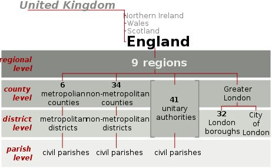
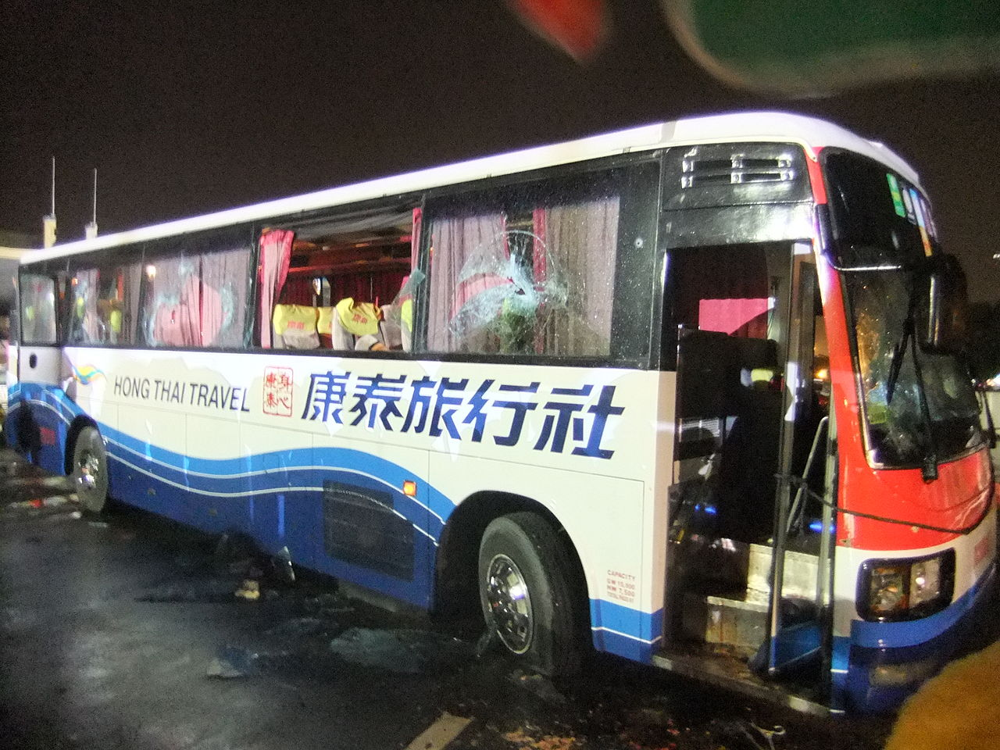
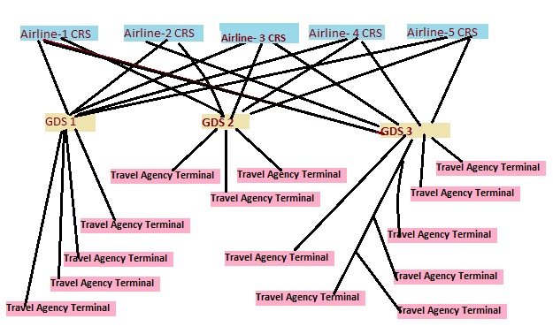
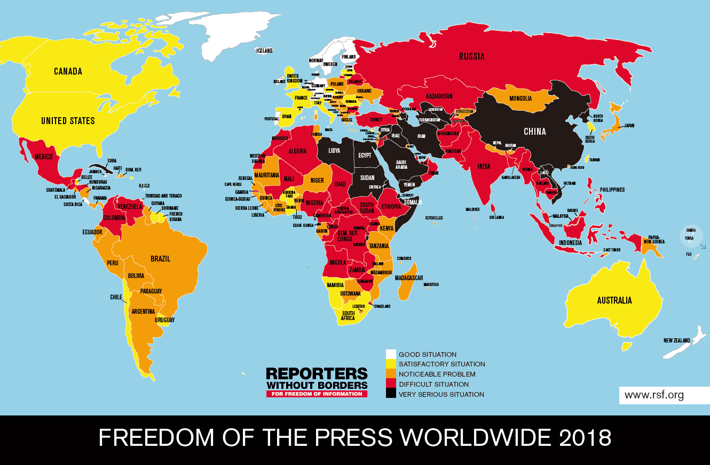
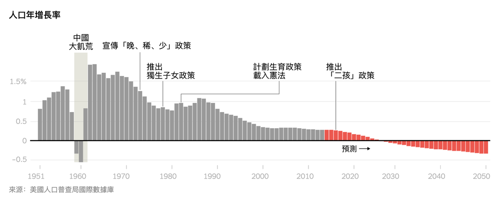
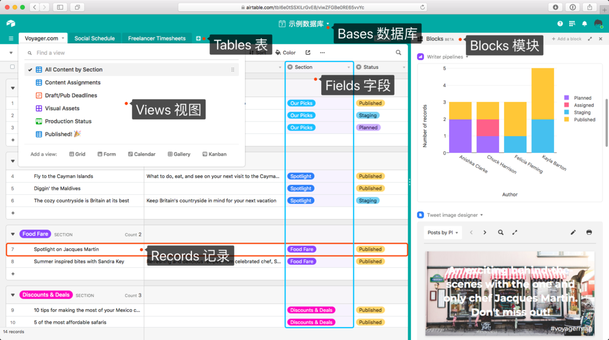
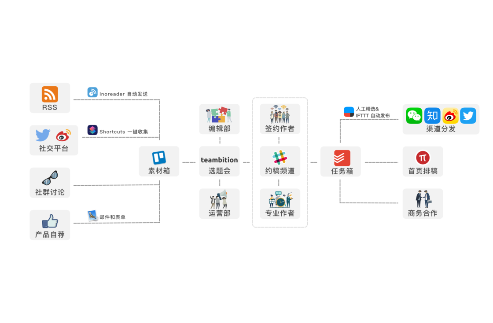
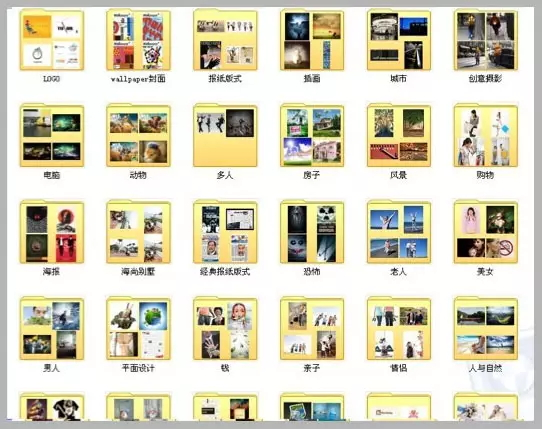

# 第03周

# 引言

工作生活中，我会在互联网上阅读到大量文章，好的文章读完让人受益匪浅。过去我只是认为他们写得好，然后收藏起来，很少在读。这不免是一种资源浪费。所以为了更深度的获取知识，我打算以每周总结的方式激励自己进一步阅读它们。

### 信息媒介

我喜欢每天睡觉前拿手机刷刷新闻。有天突然产生了一个疑问。

在过去，父母辈多是通过报纸（或者电视，但是少）获取信息。而如今，我们大多数人则是通过手机和网络来获取资讯。而父母辈难以接受新型媒体媒介的冲击，仍对报纸偏爱有加。

问题来了，未来十几年乃至几十年过后，技术进步一定会产生新型信息媒介。到那时，我们中的一部分人就如同父母辈现在一样，落后于时代。**我们到那时会不会也会执拗于通过手机和网络获取资讯，而不太愿意接受新的媒介呢？**

图：加拿大学者麦克卢汉说过「媒介即信息」。

### [20岁的年轻人](https://www.zhihu.com/question/25658140/answer/521472323)

20岁的年轻人，最重要的是提高、扩大自己的视野和认知。对此，我给你两个方向的建议：

**第一，你要了解什么？** 你要了解社会最本源的东西，和最新潮的东西。

什么是最本源的东西？比如社会制度、经济思维、生物学特点、东西方基本文化特征和行为导向等等，这是人类社会最底层的规律。

什么是最新潮的东西？比如科技趋势、商业趋势、经济金融趋势。再具体一点，2007-2009年的时候你要了解次贷危机和危机后应对措施及反弹；2010年的时候你要了解团购、智能手机、移动互联网；2012-2015年你要了解一下网络文学爆发；2013年你可以去研究下上海自贸区；2014年的时候你得了解自媒体，如微信公众号、知乎等；2016-18年，你要了解今日头条、快手、抖音；以及最近几年来，你随时可以关注下人工智能、物联网等。

这些最新潮的东西，不管你是什么专业的，以后准备从事什么工作，我都建议你初步了解下。紧跟这些社会动态，能快速的让你了解社会、扩大视野，跟上时代步伐。

**第二个问题是，你该怎么了解？** 换句话说，这就是你需要花钱的地方。

如何才能快速了解这么多内容？原来这一直是个很难的问题，现在这个时代它突然变得简单了——知识付费。在这个时代，你可以用很低的价格买到很多的真正有用的课程，在线下课时代需要几万元的课程，现在几十几百元就更够搞定了——这就是你需要花钱的地方。这种钱花的极具性价比，具有强烈的杠杆效应，你用极少的成本就能够获得极大的视野成长。

（作者：叶修）

# 科普

### [古拉格](https://zh.wikipedia.org/wiki/%E5%8F%A4%E6%8B%89%E6%A0%BC)

古拉格是**前苏联政府**的一个机构，负责管理全国的**劳改营**。

“古拉格”是20世纪最黑暗的记忆之一，在苏联的这个强制劳改营里，异见者被囚禁在恶劣的环境里，下场往往是亡命。劳改营为列宁创建，斯大林扩建，最终由伟大的俄罗斯作家亚历山大·索尔仁尼琴(Aleksandr
Solzhenitsyn)以他1973年的杰作《古拉格群岛》(The Gulag Archipelago)公之于众。——
[纽约时报](https://cn.nytimes.com/opinion/20190104/china-gulag-for-muslims)

### [汤一介](https://zh.wikipedia.org/zh-hans/%E6%B1%A4%E4%B8%80%E4%BB%8B)

汤一介（1927年2月16日－2014年9月9日），天津人，祖籍湖北黄梅，北京大学哲学系教授，国学大师。汤一介（1927年2月16日－2014年9月9日），天津人，祖籍湖北黄梅，北京大学哲学系教授，国学大师。

汤一介曾多次公开支持**学生民主运动**，包括在六四天安门时期，与知识界和文化界33人联署致函中国全国人大常委会及中共中央，提出“释放魏京生等政治犯”等建议。习近平在六四事件25周年来临的敏感时刻，在北大高调接见汤一介，当时曾引起境外媒体关注。

### [顾维钧](https://zh.wikipedia.org/wiki/%E9%A1%BE%E7%BB%B4%E9%92%A7)

顾维钧（1888年1月29日－1985年11月14日），字少川，江苏省嘉定县（今上海市嘉定区）人，中华民国外交家。哥伦比亚大学毕业，1912年任袁世凯总统英文秘书，历任中华民国北洋政府国务总理，署理大总统、国民政府驻法国、英国大使，驻联合国首席代表、驻美大使，海牙国际法院副院长。被誉为中国现代史上最卓越的外交家之一。

### [细田守](https://zh.wikipedia.org/wiki/%E7%B4%B0%E7%94%B0%E5%AE%88)

细田守（1967年9月19日－）是一位日本动画导演，出生于富山县中新川郡上市町，毕业于金泽美术工艺大学，并从2005年起加入MADHOUSE，2012年创立地图工作室，也是日本动画制作者协会（JAniCA）会员。代表作有：《夏日大作战》、《穿越时空的少女》、《狼的孩子雨和雪》。

### [盲视觉](https://www.bbc.com/ukchina/simp/vert-fut-40134006)

世界上有极少数盲人具有"盲视觉（blindsight）"：他们的眼睛虽然看不到，但是大脑仍然能够在无意识状态下感知周围的世界。

参考阅读：[为什么我们能感觉到“背后的眼睛”？](https://www.bbc.com/ukchina/simp/vert-fut-40261158)
研究表明，即使我们没有"有意识"地看到有人在看我们，我们也可以感觉到有人在看我们。

### [西班牙时区](https://www.bbc.com/ukchina/simp/vert-tra-40204584)

就地理位置而言，西班牙应使用英国的格林尼治标准时间（GMT），但实际却采用了欧洲中部时间（CET）。造成这一现象的原因是因为，历史上独裁者佛朗哥（Francisco
Franco），将西班牙时间调快一小时，以对齐纳粹德国。但二战结束后，由于种种原因未能将时区调整回来，便沿用至今。

### [英国的行政区划](https://www.zhihu.com/question/22309764/answer/20955634)

这张图比较直观地反映了英格兰的行政区划层级：

1.联合王国由北爱尔兰、威尔士、苏格兰、英格兰四个国家组成；

2.
英格兰分成九个地区（region），这主要是依据欧盟条约成立欧洲大区的要求划分的，在英国国内不作为选举分区，但在欧洲议会作为英格兰选区界线；

3.
郡（county）级区划。包括都市郡、非都市郡、单一管理区和大伦敦。大伦敦是郡一级的行政区划，划分为伦敦金融城和32个伦敦自治市；其他的都市郡也类似，比如大曼彻斯特是个都市郡，划分为曼彻斯特市以及其他一些自治市。像北约克郡、牛津郡、剑桥郡则属于非都市郡。所谓单一管理区，就是郡下面不再分地区，例如怀特岛。

4.
地区（district）级区划。像上面提到的曼彻斯特，还有利物浦、伯明翰……都属于这个级别的都市区。非都市地区是从非都市郡划分来的，例如牛津、剑桥这些镇子。大伦敦下的伦敦金融城、威斯敏斯特、格林尼治……也属于这一级别。

5.
教区（parish）级。所谓民政教区，就是一些小的村镇或者城市里的分区，类似我国的乡镇、街道办事处。

（作者：季人）

参考阅读：[Administrative geography of the United
Kingdom](https://en.wikipedia.org/wiki/Administrative_geography_of_the_United_Kingdom)
英文的维基百科解释的非常详细，介绍页第一幅图可放大阅读。

查询工具：[UNITED KINGDOM: Administrative
Division](https://www.citypopulation.de/php/uk-admin.php)
可用于查询英国所有行政区划地名。

### [马尼拉人质事件](https://zh.wikipedia.org/wiki/%E9%A6%AC%E5%B0%BC%E6%8B%89%E4%BA%BA%E8%B3%AA%E4%BA%8B%E4%BB%B6)

事件发生于2010年8月23日菲律宾马尼拉时间上午约9时半，被革除的菲律宾国家警察前高级督察罗兰多·门多萨强行登上一辆属于香港康泰旅行社旅行团的旅游巴士，挟持车上包括游客、司机、导游、领队和摄影师，共25名人质，要求菲律宾政府恢复他的职务。

绑匪先后释放了9名人质，另外1名菲律宾籍司机人质成功逃脱。事件持续近10小时后，匪徒与特种武器和战术部队爆发枪战，救援行动多次暂停，后者进攻逾1小时后，最终由狙击手击毙绑匪。事件持续12小时后，以15名人质中7名受伤、8名死亡，及匪徒死亡告终。

事件造成菲律宾共和国与香港特别行政区及中华人民共和国关系紧张。事件发生后逾七年半，在2018年4月12日，菲律宾总统杜特尔特第二度访问香港期间，首次以总统身份正式向香港及中国人道歉。

纪录片：[美国历史频道马尼拉香港人质惨案The Manila Hostage Massacre（2011）](https://www.bilibili.com/video/av6123887/)

参考阅读：[惊魂未定！旅行了46个国家的我，在菲律宾遭遇了迷魂药绑架](https://mp.weixin.qq.com/s/7dMq2FpGPBDo_GJNLgn-gQ)

### [国立西南联合大学](https://zh.wikipedia.org/wiki/%E5%9B%BD%E7%AB%8B%E8%A5%BF%E5%8D%97%E8%81%94%E5%90%88%E5%A4%A7%E5%AD%A6)

国立西南联合大学，简称西南联大，是抗战时期由当时的北大、清华、南开在云南昆明共同组成的大学，前身为国立长沙临时大学。

校务最初由当时清华校长梅贻琦、北大校长蒋梦麟和南开校长张伯苓组成的常务委员会共同管理，后梅贻琦任常务委员会主席，长期主导校务。从1938年4月2日于昆明更名西南联大，5月4日正式开课，至1946年5月4日宣布结束，设立时间共8年整。期间，毕业学生2000余人。

抗战胜利以后，西南联大解散，北大、清华、南开分别迁回原址复校，唯有师范学院留昆，也就是国立昆明师范学院（今云南师范大学）。

参考阅读：[央视又出9.3分神作，读书才是门槛最低的高贵](https://mp.weixin.qq.com/s/DoPHH_O3yjUDNuJHa19NVw)

### [全球分销系统 GDS](https://baike.baidu.com/item/GDS/16824)

GDS（Global Distribution
System）指的是“全球分销系统”，是应用于民用航空运输及整个旅游业的大型计算机信息服务系统。通过GDS，遍及全球的旅游销售机构可以及时地从航空公司、旅馆、租车公司、旅游公司获取大量的与旅游相关的信息，从而为顾客提供快捷、便利、可靠的服务。

A global distribution system (GDS) is a **computerised network system** owned or
operated by a company that enables transactions **between travel industry
service providers**. The GDS mainly uses real-time **inventory** to service
providers. Thus, a GDS can link services, rates and bookings consolidating
products and services across all three travel sectors: i.e., airline
reservations, hotel reservations, car rentals. ——
[维基百科](https://en.wikipedia.org/wiki/Global_distribution_system)

### [旅客订座记录 PNR](https://baike.baidu.com/item/PNR/7031055)

PNR是旅客订座记录，即Passenger Name
Record的缩写，它反映了旅客的航程，航班座位占用的数量，及旅客信息。适用民航订座系统。

In the airline and travel industries, a passenger name record (PNR) is a record
in the database of a computer reservation system (CRS) that consists of the
**personal information** for a passenger and also contains the **itinerary** for
the passenger, or a group of passengers travelling together.——
[维基百科](https://en.wikipedia.org/wiki/Passenger_name_record)

参考阅读：[千万不要在朋友圈晒机票，名字打码了也不行！](https://mp.weixin.qq.com/s/02cdYiuPT71J4ZLeCUlwVw)

# 社会

### [电影游戏化](https://mp.weixin.qq.com/s/dRCH9_ddE99sF5XtAXGf1g)

互动式电影在游戏领域已经日趋成熟，而将来是否可以更多地在电视剧和电影领域使用则仍然是个谜团。

庞大的成本、对故事沉浸感的破坏、需要借助的外部选择等都成为了不小的障碍。如何更好地和情节、角色相融合，区别于游戏的体验感，才是现下最重要的探索点。

### [媒体自由排行](https://rsf.org/en/ranking)

颜色越浅代表越自由，**中国排名第178位**，位置靠后。同属位置靠后的国家包括朝鲜、伊朗及沙特等阿拉伯国家。

官网就**亚太地区**情况给出的说明是：中国媒体受政府控制所威胁，越南和柬埔寨等国正在复制这一模式。而西亚的阿富汗、印度、巴基斯坦等国，对记者的暴力行为令人担忧。

### [中国人口数量](https://cn.nytimes.com/china/20190118/china-population-crisis/)

中国正面临着几十年来最急剧的人口下降，有可能在不久的将来导致人口、经济甚至政治\*危\*机的发生。

### [名嘴出走央视](https://mp.weixin.qq.com/s/gbhxZWA4XOZVkeE3RIZJCA)

自2006年以来，央视人才不断出走，2012年以后央视主持人下海创业更是成为热潮。包括泛文娱、知识付费领域的马东、罗振宇、王凯（凯叔讲故事创始人），体育竞技领域的黄健翔、刘建宏、段暄，加盟投资圈的张泉灵、赵普，以及投身互联网公司的郎永淳等。

# 工具

### [自我量化](http://digg.com/2019/google-sheet-personal-organization-lifehack)

作者借助于Google Sheet
完整记录了2018年发生在自己身上的事情、养成的习惯以及生活上的细节。

参考阅读：

1）[使用 Airtable
建立自己的数据收集模式](https://sspai.com/post/42918)利：用Zapier将数据记录到Airtable，用于自我量化、后期分析。例如，记录了每天上下班的通勤时间，以计算错过高峰期的最佳上班时间。

2）[这款帮你自我量化的工具，还能做更多](https://sspai.com/post/43481)：介绍了时间管理工具Timetrack。

### [协作流程](https://sspai.com/post/52205)

老麦的2018推荐，包括硬件装备、效率软件，以及电影、音乐和书籍等。其中让我**眼前一亮**的是少数派内部协作工具流程，包括素材收集、文章选题、约稿写稿和渠道分发。

### [学习与积累](https://mp.weixin.qq.com/s/7KjSU-GlUpkkMt_1Xv-2wA)

咪蒙2016年写的文章，说明了人生各个阶段都要学习，最好的学习方法其实就是最原始的方法，笔记、错题……然后分享了一些自己做记者时的工作经验、自己如何整理素材。

参考阅读：[是的，咪蒙这篇文章我读了5遍！](https://mp.weixin.qq.com/s/ZjnFXFqpCcBusPASWgwevg)

讲了三个人物的例子：咪蒙、小马宋和阿文。大家都是靠持之以恒的积累成为大师的。

### [阮一峰：每周分享第40期](https://mp.weixin.qq.com/s/l5sbsw9x-5XWg1shXch9TA)

[《几何原本》在线版](https://www.c82.net/euclid/)：在线还原1847年的欧几里得《几何原本》的彩色版本

[12
款助你学编程的免费游戏](https://zhuanlan.zhihu.com/p/23936161)：评选出12个热门网站，可以通过玩游戏学习编程。试完了下[CodeCombat](https://codecombat.com/play)，寓教于乐，非常有意思。

### 新发现

[36氪国际站](https://kr-asia.com/)：36氪网站新孵化的数字媒体，致力于探索亚洲创新创业市场

[小鸡词典](https://jikipedia.com/)：最全的网络流行语词典

[BoingBoing](https://boingboing.net/)：BoingBoing是一个综合类博客，最吸引人的地方在于，很平淡无奇的事情，在BoingBoing中也会变得有趣起来

[The
Pudding](https://pudding.cool/)：用**可视化图表**的形式解释有趣的文化现象，有点类似数据分析，但是更有趣，多看几篇文章你觉得会喜欢这个网站
