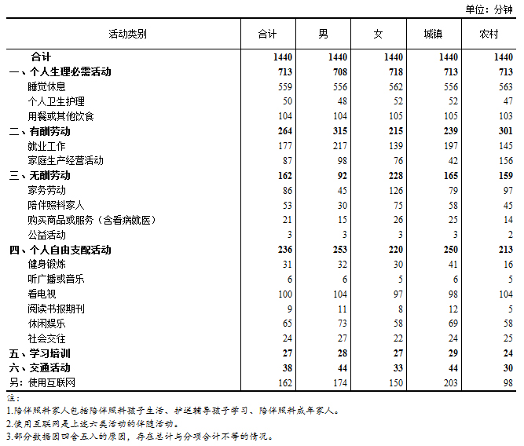

# 第04周

# 引言
工作生活中，我会在互联网上阅读到大量文章，好的文章读完让人受益匪浅。过去我只是认为他们写得好，然后收藏起来，很少在读。这不免是一种资源浪费。所以为了更深度的获取知识，我打算以每周总结的方式激励自己进一步阅读它们。

# 科普
## 记忆中的张晓辉
我总以为还有见面的机会，总觉得还有的是时间。所以，当听到他去世的消息后，不敢相信。

1月18日，他中风住院，四天四夜没有抢救过来，于1月22日辞世。这个才华横溢的昔日高考状元，就这样走完了他坎坷的人生之路。

其实细细算起来，我和他只不过在校园里共同度过一年半的时间。可是，我觉得认识他很久很久，而且他对于我的影响很深很深。

人，可以活得像张晓辉一样：善良、丰富、纯粹、执着，如飞蚊扑火，却义无反顾。这样的人生，没有物质的富足，没有众人的拥戴，甚至也没有寿终正寝。但是，它也是光辉的，因为它照亮了一些人的生命，比如我。[原文链接](https://www.meipian.cn/1vmie5nx)

--

张晓辉，北京大学历史系1984级学生。曾任北京万圣书园学术总监。后从事图书策划、编辑行业，策划、出版外国文学、学术著作多种。2019年1月22日因脑梗塞离世。[豆瓣介绍](https://www.douban.com/group/topic/131794497/)

## 萌系侵略性
太可爱会让大脑产生破坏的冲动，科学家将这一现象称为“萌系侵略性（cute aggression）”。

根据发表在《 Frontiers in Behavioral Neuroscience》期刊上的一项研究，加州河滨分校的心理学家 Katherine Stavropoulos 和同事纪录了 54 名年轻成年被试观看可爱卡通和普通人物肖像的大脑活动，发现可爱卡通与大脑情感相关区域的强烈活动相关联。

一个人越感到“萌系侵略性”，其大脑奖励系统的活动越强烈。这一结果暗示了“萌系侵略性”是由大脑中奖励和情感力量驱动的。侵略性这一负面情绪的出现可能有助于控制疯狂的积极情绪。[原文链接](https://www.solidot.org/story?sid=59161)

--

萌系侵略性是指，看到可爱的东西（例如人类婴儿或幼小动物）引起的表面上的攻击性行为。经历萌系侵略性的人可能会咬牙切齿，握紧拳头，或者感觉到挤压和挤压他们认为可爱的东西的冲动，而实际上并没有造成或意图造成任何伤害。[维基百科](https://en.wikipedia.org/wiki/Cute_aggression)

## 西班牙旅行达人乔治·桑切斯
你告诉过我，年轻时旅行比等退休后再旅行更好。你是建议存钱退休，还是先尽情旅行，以后再考虑钱的事情？

我想每个人都必须找到自己的方式。最糟糕的事情是把人生浪费在你没有激情的事情上。有些人喜欢工作一辈子，一直存钱直到退休，每年假期时像游客一样旅行一两次。然后到60岁时，他们开始密集旅行，甚至是疯狂的旅行，好像试图找回失去的时间。

我在旅途上总共花了30年，现在我62岁了，我的钱花完了，也没有办法赚钱。 这就像是蚱蜢的寓言，蚱蜢一个冬天都在唱歌，而蚂蚁辛勤劳动为冬天储存食物。我是蚱蜢。我没有什么可后悔的，我对我选择的生活感到高兴，所以现在我必须面对后果。[原文链接](https://www.bbc.com/ukchina/simp/vert-tra-38598808)

## 春晚进化论
每年一度的抢红包大战，在短短五年间就演变为新时代的春节新习俗，也成了互联网企业的竞技场。

微信先是在2014年推出春节红包自娱自乐，又在2015年和春晚节目取得了合作；而后支付宝、淘宝也先后与春晚合作；今年的春晚红包互动合作又被百度拿下。[原文链接](https://mp.weixin.qq.com/s/y2VzBSiZ9_iNUw3YuR7WjQ)

# 社会

## 北大毕业生送外卖
在女朋友出国后，我辞掉了坐写字楼的工作，去做了一名外卖员。穿上蓝色制服的时候，我对着玻璃里面的自己拍了张照片，心想：我现在已经来到了你告诉我的底层，你们还能把我怎么样。[原文链接](https://mp.weixin.qq.com/s/R5nSlfnB9f1iOKYKKxISOw)

## 送外卖与阶层焦虑
名校毕业生、外卖配送员，两种身份叠加造成错位感，使得他的记录成为2019年第一篇刷屏文章。截至目前，仅在知乎，参与《一个北大毕业生决定去送外卖》一文讨论的就有100万人次。随着文章爆红，部分人也开始质疑这篇文章消费北大，消费底层。

对张根来说，当一名外卖配送员，是为短暂逃离原来圈子步步紧逼的失败感。

“人难道一定要到了吃不饱、穿不暖的地步，才有正当的资格去表达、证明自己的不快乐吗？”张根说，生活经验告诉他，失败不只有无法温饱一种形态。而任何形态的失败，对人的意义是无差别的。[原文链接](https://mp.weixin.qq.com/s/5UNfGX0OaD2vhblwEYbbJA)

## 互联网中心化

互联网中心化之后，用户的利益就开始不断被侵犯。过去内容分布在互联网各个角落，想找到他们需要花点时间，但是想干掉它们也不太容易。今天，你往朋友圈转一篇王五四的文章就知道了，不出10分钟，就会有无数好友告诉“已经看不到了”。

除了“根据法律法规”删除文章之外，一个企业可以创造无数理由，轻松让自己平台上的内容消失。过去，内容掌握在创造者自己手里，企业没法轻松干掉它们。换一个角度，过去那些需要动用法律才能拥有的权利，现在已经被下放到了企业手里。

企业控制的不仅仅是一个帖子，他们控制的是数据，并且是用户创造出来的，本来不属于他们的数据。

再看最近苹果下架应用的这件事，这里我们不讨论苹果在此事中的态度，只看本质。从本质上说，苹果提供了设备和通道，真正的购买关系是最终用户（使用iPhone的人）和开发者之间（开发App的人）形成的，苹果商店提供了一个通道。

但现在问题是苹果这家公司，可以在买卖双方完全同意的情况下，使得这个生意做不成。最终用户愿意花钱，开发者甚至愿意免费提供，但就算买卖双方都同意，只要苹果不同意，用户就得不到这个app，因为iPhone是封闭系统，除了通过app store，用户没办法把app装到自己手机上。（企业部署可以解决一点点问题，但这里我们不讨论这种特殊情况）。[原文链接](https://mp.weixin.qq.com/s/w8h0XrPugrPu3ynZP55uXw)

## 搜索引擎百度已死
最近半年使用过百度的朋友，可能会注意到一个现象：你在第一页看到的搜索结果，基本上有一半以上会指向百度自家产品，尤其频繁出现的是“百家号”。

百家号是百度的自媒体平台，刚推出的时候曾经主打过优质作者和高品质内容，后来几经调整，现在成了一个以营销号为主体的内容平台——内容包罗万象，数量很大，质量堪忧。[原文链接](https://mp.weixin.qq.com/s/OL-WcP0LgGktNgL5yd1hiQ)

## 百度现象与中国互联网
百度现象折射了中国互联网产业的现状：在不应干涉的领域强力管控，在最应监管的地方却非常放任。

这种放任也造成了中国互联网的各种恶劣生态。最突出的就是各大互联网巨头为了将流量留在自己的产品里，采取分封割据的做法，建起自己的“围墙花园”（walled garden），封杀竞争对手的产品，将“互联网”变成“不联网”。

在微信里，你无法分享抖音的短视频，无法打开淘宝链接；在微博里，你提及“微信”两个字就会被降权，也就是说这条信息会被更少人看到；在百度里，你搜索不到淘宝、微信、今日头条的内容；在今日头条里，也基本上不可能有链接让你跳到头条之外的网站。

虽然“围墙花园”是一个世界性的现象，但是没有哪个国家的围墙花园有中国的程度这么高。你很难想象在Google上搜索不到亚马逊的产品，在Facebook上不能分享YouTube的视频。当信息的流动被斩断，信息也就如同死水一般，会很容易腐臭，滋生出更多的假新闻、标题党等劣质信息——当然，也更有利于信息管制，只要盯住了几家互联网巨头，就控制住了大部分的信息。[原文链接](https://www.bbc.com/zhongwen/simp/chinese-news-46997294)

## 18年全国时间利用调查公报

国家统计局发布了《2018年全国时间利用调查公报》，值得关心的互联网使用时间，调查称，居民使用互联网的平均时间为2小时42分钟。

其中，男性2小时54分钟，女性2小时30分钟；城镇居民3小时23分钟，农村居民1小时38分钟。主要通过手机或PAD上网和通过其他设备上网。[原文链接](http://www.gov.cn/xinwen/2019-01/25/content_5361065.htm)

## 苹果新年广告：一个桶
从影片的角度来说，《一个桶》是细节丰富，矛盾递进，感情丰富的电影。如果要打分，是一定八分以上的，影片唯一的遗憾，在于鸡蛋的笑脸可能会有些跳戏。这不符合中国父母表达爱的方式，有一些强行升华。但，瑕不掩瑜。这是一部好电影。[原文链接](https://sspai.com/post/52705)

## 中国人与菲律宾博彩业
来菲律宾 4 年，老汤做过客服，做过狗推，也做过人事，从小汤做到了老汤。孤独可能是最多的感受。

老汤说这里的国人，不是刚进社会被骗过来的，就是在国内犯了事儿跑过来躲着的，不过老板基本都是福建人，家族观念强，管理岗位都是亲戚。为了保密，公司上班的时候上交私人手机，抽烟上厕所每次最多十分钟，多了扣钱，吃饭都是行政拿外卖来，在工位上吃。[原文链接](https://mp.weixin.qq.com/s/5P9zJDXmsG5NF9loj7VL1g)

## 美政府停摆结束
2019年1月25日，美国政府史上最长的一次“停摆”终于结束，总统特朗普签字通过政府持续决议案，让政府保持现状开门到2月15日，并期望在此期间两党能就边境安全问题达成一个妥协。[原文链接](https://theinitium.com/article/20190128-opinion-huajianping-shutdown-trump-pelosi/)

这场政府停摆为美国历史上最长一次，共计35天。[图片来源](https://www.economist.com/united-states/2019/01/25/our-coverage-of-the-american-government-shutdown)

## 人口地形与城市房价
从长期来说，一个城市未来有没有发展，和人口的多少是强相关的，这点不言自明。对于各地的人口情况，如果仅仅是看数据，普通人是看不出什么，也没有太多的感觉的。

有几个老外搞了一个项目，利用开源的数据，将世界各地的人口数据投影在世界地图上，这样看上去就直观多了，而且能发现很多有意思的东西。[原文链接](https://mp.weixin.qq.com/s/VhCJDj8pvglLm6Bu_onzDA)

地图来源：[The Pudding: Population Mountains](https://pudding.cool/2018/12/3d-cities-story/index.html)
（该网站在阮一峰的每周分享第40期也提到过。）

## 全球智商排名
在一项对全球113个国家和地区的智商调查中，研究人员通过收集到的数据绘制了“智商地图”。该调查从2002年开始，至2006年结束，由英国心理学教授Richard Lynn和芬兰政治科学家Tatu Vanhenen共同完成。

从图中可以看出，智商排名靠前的国家和地区主要集中在东亚，其中香港排名第一，紧随其后的分别是新加坡、韩国、日本和中国。而排名靠后的国家多数位于非洲中部。

参考阅读：
- [World ranking of countries by their average IQ](https://brainstats.com/average-iq-by-country.html)
- [Wikipedia - Nations and intelligence](https://en.wikipedia.org/wiki/Nations_and_intelligence)

## 世界各国的VPN合法性
VPN是否合法取决于你在哪个国家。然而很多管制和限制是不透明的，处于黑色地带。[原文链接](https://medium.com/@iyouport/%E6%9C%89%E5%A4%9A%E5%B0%91%E5%9B%BD%E5%AE%B6%E7%A6%81%E6%AD%A2%E6%88%96%E9%99%90%E5%88%B6%E4%BD%BF%E7%94%A8-vpn-%E5%85%A8%E7%90%83%E4%BA%92%E8%81%94%E7%BD%91%E5%AE%A1%E6%9F%A5%E5%88%86%E5%B8%83%E5%9B%BE-vpn-%E5%9C%A8%E4%BD%A0%E7%9A%84%E5%9B%BD%E5%AE%B6%E5%90%88%E6%B3%95%E5%90%97-bd377b73eb4d)

网友评论：非常详细的各国是否允许使用 VPN 的列表。不过有一点需要明确：「使用 VPN」和「获取完整的互联网体验」不可等同。对于大部分国家的 VPN 用户而言，他们使用 VPN 的目的在于保护个人隐私，而非「翻墙」。

# 工具
## DuckDuckGo的故事
2009年，ddg提出了一个重要的概念，叫做“尊重隐私的搜索”。更技术的表达是“不追踪用户行为，不存储用户搜索历史”，这个概念在2009年听起来根本不重要，那还是一个大家觉得“我热爱互联网，我愿意出卖隐私”的时代。但之后的这些年里面，世界变得越来越快，到现在它已经变成ddg的核心竞争力之一。[原文链接](https://jhuo.ca/post/ddg/)

## 如何礼貌地拒绝Offer
作为企业，我们常常会在看到一个还不错的候选人时，会表示先拿手里，再多看看。那反过来优秀面试者手里拿到offer的时候，也会再多跑几家，再多看看，这是无可厚非的。

作为企业方，第一他最在乎的不是你礼貌不礼貌，而是及时的反馈。这关系着他要不要停了招聘这一条线。第二，当你拒绝时，一个成熟的企业也不会关心你是不是足够客气，他更希望得到尽可能多的有效信息。这关系着他接下来的工作方向是否调整。

所以说，就企业而言，他最讨厌的，是发了offer后，不回应，也不拒绝，一直吊着的那种人。而他最喜欢的，是那种尽可能多的，把“为什么不想来”“下家去哪了”“下家给你开了多少钱”等统统告知我们的人。（事实上这种人不太可能存在）

因此，与其说求职者在考虑如何礼貌地拒绝offer，不如说用人单位也在考虑，如何礼貌地询问出更多的信息。[原文链接](https://www.zhihu.com/question/19905845/answer/528190900)

## 中文排版规范
本项目收集整理了中文排版所需遵循的标准和规范。
* 对于相关的国家标准，尽量收集其原始扫描档，并选择最清晰的版本；
* 对于已废止的国家标准，用其替代标准进行了替换；
* 增加了一些在网络上收集到的，对标准和规范的解释说明文档。

注意： 本项目所收集的资料全部来源于网络，仅供个人学习和参考使用，请勿用于任何商业用途。如无意中侵犯了您的版权，请与此项目的管理者联系，我们会立即将其删除。

[项目地址](https://github.com/hub0/typesetting-standard/blob/master/README.md)

## 纽时：2018一百本书
时报书评编辑评选出了本年度最值得关注的100本小说、诗歌和非虚构类书籍。[原文链接](https://cn.nytimes.com/interactive/20190101/100books/index.html)

## 阮一峰：每周分享第 41 期
[原文链接](http://www.ruanyifeng.com/blog/2019/01/weekly-issue-41.html)
* [Facebook申请新专利寻找人与人之间的联系](https://gizmodo.com/facebook-knows-how-to-track-you-using-the-dust-on-your-1821030620)
* [谷歌地图：国际空间站视角](https://www.google.com/maps/@29.5602853,-95.0853914,2a,75y,212.04h,90t/data=!3m7!1e1!3m5!1szChzPIAn4RIAAAQvxgbyEg!2e0!3e5!7i10000!8i5000?shorturl=1)
* [孤儿药法案的颁布来源及影响](https://99percentinvisible.org/episode/orphan-drugs/)

