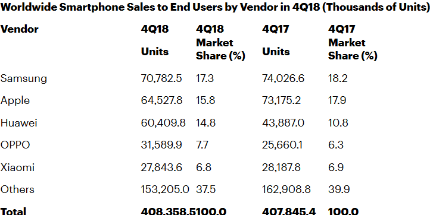
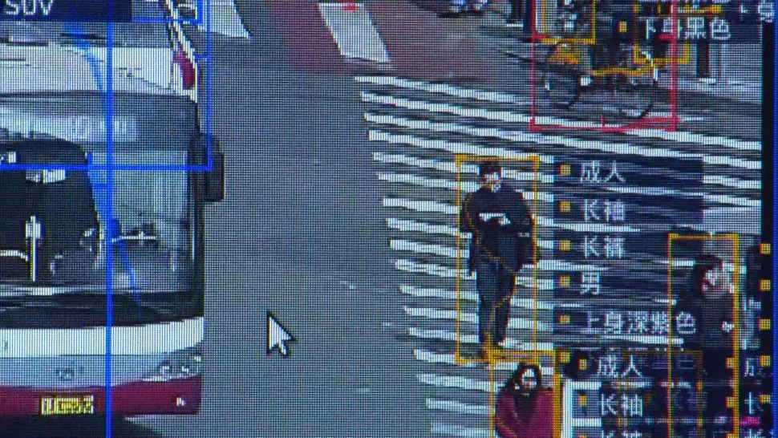

# 第08周

引言
====

工作生活中，我会在互联网上阅读到大量文章，好的文章读完让人受益匪浅。过去我只是认为他们写得好，然后收藏起来，很少在读。这不免是一种资源浪费。所以为了更深度的获取知识，我打算以每周总结的方式激励自己进一步阅读它们。

科普
====

中国火车之最
------------

* 单程运行时间最长的是：阿克苏\~杭州K596/593次，全程用时68小时33分

* 单程票价最贵的是：北京南\~昆明南G403/404 G405/406次，商务座为3623元

* 单程运行距离最长的是：广州\~拉萨Z263/4/5/6次，运行距离为4979公里。但因为Z264次在西宁站同台换乘，故单次里程最长的也是：阿克苏\~杭州K596/3次，里程为4933公里（[即刻热门](https://m.okjike.com/originalPosts/5c6e585429e8da00119b244d?share_distinct_id=168efa9d935123-0d898cf7aaed42-1333063-1327104-168efa9d937526&share_depth=1)）

环闽动车
--------

2019年1月5日，全国铁路调图后，南铁将适时开行这两趟“环闽”动车。这两趟环形动车线分别为厦门往返厦门的D6318/5次、福州南往返福州南的D6312/3/2次。它们将在绕福建省（除宁德、平潭外）一圈后再回到始发站。其中，福州南至福州南全程约6小时11分钟，厦门至厦门为6小时30分钟。（[新华网](http://www.xinhuanet.com/2018-12/19/c_1123877004.htm)）

帕米尔高原
----------

帕米尔高原，古称葱岭，是古代中国和地中海各国的陆上通道丝绸之路之必经之地。据《西河旧事》“其山高大，上生葱”而得名，地理上属亚洲中部，位于中国、塔吉克斯坦和阿富汗的边境上。

高原最高峰为中国境内的公格尔山（7649米）。帕米尔高原也是亚洲主要山脉的汇集处，包括喜马拉雅山、兴都库什山等五大山脉，号称**世界屋脊**。目前除东部倾斜坡仍为中国所管辖外，大部分属于塔吉克斯坦，只有瓦罕帕米尔属于阿富汗。（[维基百科](https://zh.wikipedia.org/wiki/%E5%B8%95%E7%B1%B3%E7%88%BE%E9%AB%98%E5%8E%9F)）

帕米尔公路地质活动剧烈，沿途要穿过高海拔的垭口、地震频发地带以及山体滑坡和落石区域，这让帕米尔公路成为最具挑战性的驾驶路线之一，但极端的自然环境也吸引着热爱壮阔荒野风光的机车手、自行车手和冒险家。（[BBC英伦网](https://www.bbc.com/ukchina/simp/vert-tra-47315388)）

这6个“非法国家”，为什么一直活到了现在？
---------------------------------------

除了国际社会普遍承认的主权国家以外，还有一些事实上已经独立，但因为种种原因而无法为国际社会所承认的小“国”。这些政治实体分布全球各大洲，而又以俄罗斯周边为数最多。由于得不到国际社会的认可，这些实体间还互相建立了外交关系，俨然一副和联合国玩平行宇宙的态度。这是怎么回事呢？（[地球知识局](https://mp.weixin.qq.com/s/P4WVZZO6o8DUYblfy6nDlg)）

美国四大家族
------------

在美国诸多的政治世家中，最为引人注目的莫过于四大家族。按照时间排列，分别是：亚当斯家族、罗斯福家族、肯尼迪家族和布什家族。（[百度百科](https://baike.baidu.com/item/美国四大家族/12759564)）

塔西佗陷阱
----------

塔西佗陷阱（Tacitus
Trap）是指古罗马史学家塔西佗所提出的一种见解，他认为当政府不受欢迎的时候，好的政策与坏的政策都会同样得罪人民。这个见解后来被指认成为一种社会政治现象或政治学定律，它指一个社会机构(或组织或部门等)一旦失去社会公信力，那么它无论办什么事情或表达什么言论，都不会引起人们的相信，相反被认为是说假话、做坏事。（[MBA智库百科](https://wiki.mbalib.com/wiki/%E5%A1%94%E8%A5%BF%E4%BD%97%E9%99%B7%E9%98%B1)）

确认偏误
--------

确认偏误（Confirmation
bias）是个人选择性地回忆、搜集有利细节，忽略不利或矛盾的资讯，来支持自己已有的想法或假设的趋势。（[维基百科](https://zh.wikipedia.org/wiki/%E7%A2%BA%E8%AA%8D%E5%81%8F%E8%AA%A4)）

主观验证
--------

主观验证（Subjective
Validation），有时也称为个人验证效应，是一种认知偏误，即某人由于一项表述或信息对其具有个人意义或较为重要，而认为该表述或信息是正确的。换言之，观点被主观验证所影响的人会认为两个无关的事件（即巧合）相互关联，是因为他们的个人信念需要两者相关。（[MBA智库百科](https://wiki.mbalib.com/wiki/%E4%B8%BB%E8%A7%82%E9%AA%8C%E8%AF%81)）

敌对归因偏见
------------

为什么在互联网上人们的怒气如此之大？研究者们在心理学领域找到了一个原因：“敌对归因偏见”。

来自美国杜克大学的心理学家Kenneth
Dodge曾经做过一个有趣的实验。他找来两组学生来全神贯注地搭积木，一组学生的侵略性人格程度较高，另一组则较低。不过，他在实验中设计了一个小把戏——在学生们正在搭积木时，他安排另一位学生“正巧”路过，并假装不小心碰倒他们正在搭建的积木。

这时他发现，那些侵略性人格较高的学生会勃然大怒，认为这个人是故意来搞破坏的；那些侵略性人格较低的学生则更愿意认为，这个人仅仅是无心之举，没有任何恶意。于是他总结说：**一个人的侵略性人格程度越高，他就越容易将模棱两可的信息解读为敌对信息。别人的无心之举，往往会被侵略性人格高的人认为是不怀好意。**（[豆瓣](https://www.douban.com/note/701140855/)）

人物
====

让你了解最全面最真实的老佛爷
----------------------------

新闻报道他去世的消息后，全世界都在哀悼。后辈设计师们向他致敬；合作伙伴们表示感谢；时尚爱好者们悲痛不已；就连可能只听说过他名字的人都在朋友圈为他点了蜡烛。

在秀场以外，我见过老佛爷一次。一群人围簇着他在街上走。那时候他也已经快80了，但脚步之快，就像竞走运动员一样，旁边那些年轻小伙子跟着都有些吃力。当时我就想，这老头儿可太厉害了，怪不得大家都叫他时尚圈的“永动机”。现在，永动机突然就停了，让大家挺错愕的。

于是媒体博主们纷纷都写文章来缅怀和回顾他的人生。昨天我也想写，但总觉得不应该太轻率。整理了很久的思路，我才决定：要写一篇让大伙儿能认识最全面最真实的他的文章。希望你看完后，对他的了解也不仅仅是时尚大帝、老佛爷，香奈儿的设计师而已。（[Gogoboi](https://mp.weixin.qq.com/s/QGA28hjumRCtLgjJ9Tlkow)）

小柴昌俊的故事
--------------

有一天，他来宿舍澡堂洗澡。蒸腾的水汽中，他忽然听到有人在议论自己。“小柴君准备考哪个系？”声音来自一位同学。“他物理不行，所以可能是哲学或文学吧，反正不是物理……”回话的是就是小柴的物理老师。

当时的东大物理系只有学习成绩非常好的学生才敢报考。小柴的成绩全校中游，本就是毫无希望。可物理老师的这番话，却触及了小柴的自尊心。于是，他几乎抱着拼死一搏的心态，开始玩命学习物理。三个月后，他考上了东京大学，物理系。（[果壳网](https://mp.weixin.qq.com/s/uFRLZScrtKVOqF9i182wAg)）

小柴昌俊，日本物理学家，日本学士院会员。现任东京大学国际基本粒子物理中心（ICEPP）高级顾问，东京大学最初4名特别荣誉教授之一。

1987年，小柴教授在超级神冈探测器完成人类史上首次的**中微子发生观测**。2002年，小柴与户冢洋二、梶田隆章三人同获潘诺夫斯基实验粒子物理学奖。同年因其“在天体物理学领域做出的先驱性贡献，其中包括在探测宇宙中微子和发现宇宙X射线源方面的成就”而获得**诺贝尔物理学奖**。（[维基百科](https://zh.wikipedia.org/wiki/%E5%B0%8F%E6%9F%B4%E6%98%8C%E4%BF%8A)）

伊桑巴德：最伟大的100名英国人第二名
-----------------------------------

伊桑巴德·金德姆·布鲁内尔（Isambard Kingdom
Brunel）是一名英国工程师，皇家学会会员。在2002年英国广播公司举办的**“最伟大的100名英国人”评选中名列第二**（仅次于温斯顿·丘吉尔）。

排名前十的其他人物大多耳熟能详，唯独排名第二的伊桑巴德对中国人来说十分陌生。他的贡献在于主持修建了大西部铁路、系列蒸汽轮船（包括第一艘螺旋桨横跨大西洋大蒸汽船）和众多的重要桥梁。他革命性地推动了公共交通、现代工程等领域。（[维基百科](https://zh.wikipedia.org/wiki/%E4%BC%8A%E6%A1%91%E5%B7%B4%E5%BE%B7%C2%B7%E9%87%91%E5%BE%B7%E5%A7%86%C2%B7%E5%B8%83%E9%B2%81%E5%86%85%E5%B0%94)）

中科大失联博士的最后人生
------------------------

在王凯眼里，最近一年，刘春杨“过得比较颓废”。作为临近毕业的博士，本应有很多事要忙，写论文、找工作等等，但刘春杨“像是不知道自己以后该干啥”。（[新京报](http://www.bjnews.com.cn/inside/2019/02/19/548056.html)）

江歌案两周年：一段网络欺凌史
----------------------------

我们每一个人可能都是江歌案中的施暴者。在这个信息爆炸的时代，江歌案的话题度和影响力却不只是两年。江歌的妈妈江秋莲始终在承受着，不弱于刘鑫所承受的网络暴力伤害。（[豆瓣](https://www.douban.com/note/701140855/)）

菲律宾“最危险”的女人瑞萨被抓
----------------------------

去年刚获选为时代杂志年度风云人物的菲律宾记者瑞萨（Maria
Ressa），2月13日在她所创立的新闻机构《拉普勒》（Rappler）办公室，因涉嫌网络诽谤遭国家调查局逮捕，隔日获准保释。

该事件遭国际组织批评菲律宾当局打压新闻自由。无独有偶，在瑞萨遭逮捕前一天，同样在东南亚的泰国，政府以攸关国家安全为理由，2月12日下令关闭Voice
TV电视台15天。（[BBC中文](https://www.bbc.com/zhongwen/simp/world-47277472)）

图说
====

600岁的故宫首次夜间开放
-----------------------

即将迎来600岁生日的北京故宫，在2019年元宵夜罕见向公众开放，这是紫禁城建筑群第一次在夜晚被点亮，也是中国末代皇帝溥仪离宫后，故宫94年来首次举办此类活动。（[BBC中文](https://www.bbc.com/zhongwen/simp/chinese-news-47301736)）

2018年15个全球品牌价值排名
--------------------------

2018年15个全球品牌价值排名（单位百万美元）：苹果、谷歌、亚马逊、微软、可口可乐、三星、丰田、奔驰、脸谱、麦当劳、英特尔、IBM、宝马、迪斯尼、思科。（[方舟子](https://twitter.com/fangshimin/status/1099212003292327936)）

图片来自：[Youtube](https://www.youtube.com/watch?v=BQovQUga0VE) \|
数据来自：[Interbrand](https://www.interbrand.com/best-brands/best-global-brands/2018/ranking/#?listFormat=sq)

世界绿化程度
------------

NASA最新卫星资料显示，过去20年地球变的更绿色。中国和印度的植被覆盖率过去20年猛增，功不可没。（[NASA](https://twitter.com/NASA/status/1095144214533410816)）

参考阅读：[Human Activity in China and India Dominates the Greening of Earth, NASA Study Shows](https://www.nasa.gov/feature/ames/human-activity-in-china-and-india-dominates-the-greening-of-earth-nasa-study-shows/)

沪C车牌
-------

沪C是全国唯一不能进上海市区的车牌。（[新浪网](http://auto.sina.com.cn/j_kandian.d.html?docid=fynwxum4198965)）

社会
====

中国人假期65年变迁史：单休改双休用了45年
----------------------------------------

如今的一周休两天，放在二十年前还是个奢望。1949年新中国成立，根据当时政务院发布《全国年节及纪念日放假办法》，我国法定假日的基本格局：每年四个节假日，元旦1天、春节3天、“五一”1天、“十一”2天，全民法定假日共7天。

与此同时，我国一直实行的每天8小时、每周48小时的工时制度。算下来，就是一周工作六天，星期天公休，全年52天公休。加上法定假日7天，全国每年的法定休息时间为59天。“单休时代”就此开始。虽然有着星期日休假的规定，但是真正能享受到假期氛围的人，还是少数。（[新浪网](http://news.sina.com.cn/c/zg/jpm/2015-08-11/17481336.html)）

知网连年涨价涉嫌垄断，学术与商业该如何平衡
------------------------------------------

截至2017年底，中国知网拥有机构用户2万多家，个人注册用户2000多万人，全文下载量达20亿篇次/年，网站同时在线用户超过15万人。想要阅览和获得知网内容并不是免费的。但由于其在学术资源上“大而全”的优势，因此各高校图书馆基本都是知网的客户。知网一直保持着60%左右的毛利率，而这也与其极高的市场占有率有关，但是近年来已发生数起高校因不满知网涨价而暂停续订的新闻，其中不乏北京大学等知名院校。（[科学网](http://news.sciencenet.cn/htmlnews/2019/2/422989.shtm)）

我们研究了赵薇、黄晓明、王小帅等17位明星的大学论文
--------------------------------------------------

出于好奇心，我找到了一批电影创作者在各个时期所撰写的论文，想看看他们到底写了什么？写得如何？

这里面有北京电影学院毕业的赵薇、许晴、陈坤、黄晓明、俞飞鸿、王志文、张丰毅、祖峰，还有论文画风完全不同的中央大学的张钧甯，也有大家都「想死他了」的冯巩，以及几位著名导演如陆川、梅峰、曹保平、徐浩峰；还有去年凭借《我不是药神》一鸣惊人的文牧野，和最近在柏林大放异彩的王小帅和娄烨，也被我们找到了他们在学生时代的论文。

平心而论，写得不错的还真不少！（[虹膜](https://mp.weixin.qq.com/s/i2ZYa5_GErg0_jbZwoKECA)）

澳大利亚昆士兰州车牌允许使用表情符号
------------------------------------

千禧年一代正在接管这个世界。他们喜欢的东西正在渗透到我们的生活里。从下个月开始，昆士兰州车牌将允许使用表情符号。

Royal Automobile Club of Queensland (RACQ) 女发言人 Rebecca Michael
表示，允许司机使用表情符号与允许他们用自己最喜欢的球队等主题来表达自己并没有什么区别。不过，司机并不允许用表情符号完全取代数字字母，而且目前可选的表情符号只有五种，分别为：大声笑，眨眼，太阳镜，心眼和标准笑脸符号。（[科技行者](https://www.solidot.org/story?sid=59651)）

30年后吃不上巧克力
------------------

据英国媒体报道，受全球变暖的影响，巧克力可能要走向灭绝了，因为生产巧克力的原料可可树在日益变暖的气候条件下越来越难以生存。全球变暖如果持续下去，对于可可树来说，这可能就是灭顶之灾。然而，受到全球变暖影响的作物可不止这一个，它很有可能会影响每个人的餐桌，美味的啤酒就是其中之一。（[中国科普博览](https://mp.weixin.qq.com/s/JYx3yoP35Uzp9nS7fGW1hQ)）

鼠辈乌托邦，郁郁在樊笼
----------------------

在“乌托邦”世界里，小鼠“随着生存空间的日渐拥挤，小鼠之间针对领地，配偶与等级地位的争夺日趋激烈，整个社会开始出现畸变。优势雄鼠变得更具侵略性，形成集团帮派，
攻击母鼠和幼鼠，交配行为也受破坏，一些雄鼠变成同性恋，其它的变成泛性恋和性亢进”。

Calhaun博士认为，当所有可用空间都被占用并且所有社会角色都被填满后，新生个体所经历的竞争和压力远超其所接受的生存历练和精神传承，从而造成复杂社会行为的崩溃，最终导致群体的消亡。

这种高密度种群生活方式所带来的对动物行为的严重负面影响也见诸于包括猴子在内的其它多种动物，
尽管不同的动物所受的影响可能有所不同。**这是否也是人的宿命我们尚不得而知。**（[BioArt](https://mp.weixin.qq.com/s/4ply0TCsFf-EvYWSqfZ9xg)）

科技
====

全球智能手机销售停滞
--------------------

Gartner 发布的数据显示，全球智能手机销量在 2018 年第四季停滞不前，按年仅增长
0.1%。其中苹果手机销量按年跌 11.8%，为自 2016
年首季以来最大季度跌幅，而华为手机销量则在全球五大智能手机厂商中实现最强的增长，全年计其市占率增至
13%，逼近苹果的 13.4%。

Gartner 的数据显示，去年第四季全球智能手机销量为 4.08 亿，三星电子市占率 17.3%
继续排行全球第一，第二位及第三位分别为苹果及华为，市占率分别 15.8% 及
14.8%。（[科技行者](https://www.solidot.org/story?sid=59642)）

中国公司的人脸识别数据库外泄
----------------------------

提供人脸检测和人群分析的深圳公司深网视界被发现其人脸识别数据库没有密码保护，直接暴露在网上。安全研究员
Victor Gevers 报告，数据库包含了超过 250
万用户的记录，包括身份证号码、地址、出生日期、识别其身份的位置。在 24
小时内，有超过 680 万位置被记录进去。Gevers
称，根据深网视界的实时面部识别，任何人可以跟踪一个人的行踪。（[科技行者](https://www.solidot.org/story?sid=59569)）

十一天深度体验 Model 3 之后，我想把它推荐给每一个人
--------------------------------------------------------------------------------------------------------

今年春节，特斯拉给我安排了一辆 Model 3 试驾车。Model 3
是特斯拉的入门级四门轿车，今年二月底开始首批交付。整个春节，我开着它从广州回到湖南老家，县里乡里走亲戚，过完年又大包小包回到广州。

可以说把各种用车的场景都体验了一遍：市区通勤、高速长途、乡间小路、全家出行……这十一天开下来，我想把它推荐给每一个人。它可能是你见过最酷最有科技感的车，但同时又很实用，更重要的是，买得起。（[小特叔叔](https://mp.weixin.qq.com/s/waBw-84mCU_PQT1px-emDQ)）

我被人吞了一部手机，调查后发现对方是淘宝打假人
----------------------------------------------

咸鱼卖手机，结果不仅没赚着钱，反而被骗走一部手机，凌云小哥借助技术手段成功找到骗子，找回了自己被骗走的手机和钱，整个过程极其**硬核**，让人大呼过瘾，但是涉及到的技术手段涉及灰色地带。看完强烈呼吁大家注意自己的网络信息安全。（[凌云](https://paper.seebug.org/809/)）

相关阅读：（原文或已删除，请自行搜索阅读）

* 我人肉了一个用裸照威胁女孩的变态
* 我顺藤摸瓜查到色情网站操控者的真实身份，劝他找份正经事干
* 有个姑娘被跟踪狂盯上，一调查才发现对方以组织夜跑为幌子，专搞女孩。
* 朋友圈别瞎发照片，指不定跟踪狂就是这样找到你家的

推荐阅读：

* [帐号泄露事件频发，到底什么样的密码才安全？](https://sspai.com/post/31659)
* [是时候检查一下你微信、QQ的授权管理了！](https://mp.weixin.qq.com/s/nyK_YQYtiGViFiUjPZ6myg)
* [密码都泄露啦！你还不知道？](https://mp.weixin.qq.com/s/xmPonLSefn4OwUDfa-mVbw)
* [不想惨遭盗号的话，这份指南你一定用得上](http://www.ifanr.com/app/628528)

工具
====

[阮一峰：每周分享第44期](http://www.ruanyifeng.com/blog/2019/02/weekly-issue-44.html)
----------------------

-   [数字世界中的纸张----理解
    PDF](https://type.cyhsu.xyz/2018/09/understanding-pdf-the-digitalized-paper/)：一篇面向一般用户的
    PDF 格式介绍，覆盖了 PDF 的适用场景、内部结构、常见误区。

-   [Polar](https://getpolarized.io/)：一个桌面的文档管理器，支持 PDF 文档和
    HTML 文档，有云端同步、注释、笔记功能。

-   [Musicbox](https://github.com/darknessomi/musicbox)：网易云音乐的命令行客户端。

-   [中国科大计算机学院课程资源](https://github.com/mbinary/USTC-CS-Courses-Resource)：该仓库收集中科大计算机学院的课程资源,
    包括课程电子版书籍、参考书、slides(ppt)、考试试卷、学习心得、一部分习题答案。

-   [HelloGitHub](https://github.com/521xueweihan/HelloGitHub)：分享 GitHub
    上有趣、入门级的开源项目的周刊，帮你找到编程的乐趣。

-   [死刑犯的遗言](https://www.tdcj.texas.gov/death_row/dr_executed_offenders.html)：美国得州政府有一个网页，专门收集犯人执行死刑前的遗言。

SketchCode
----------

[SketchCode](https://github.com/ashnkumar/sketch-code)是人工智能生成前端网页的工具，自动将手绘图，变成
HTML 网页。

unDraw
------

[unDraw](https://undraw.co/illustrations)是一个超棒的免费插图素材网站，网站上的插图素材设计感都很强，最酷的是网站支持线上调整插图的颜色只要选择一个颜色，所有插图都自动变成该色系。

Web Gradients
-------------

[Web Gradients](https://webgradients.com/) 网站提供180个渐变色彩，适合做设计或者做PPT使用参考。

Pixel Map Generator
-------------------

[像素化地图生成器](https://pixelmap.amcharts.com/)，支持不同格式下载。

