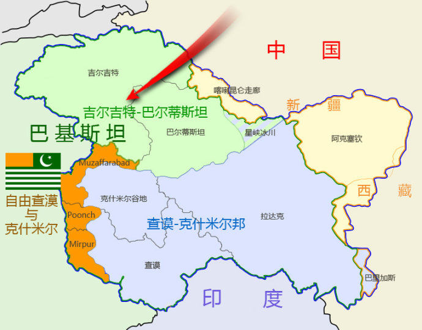
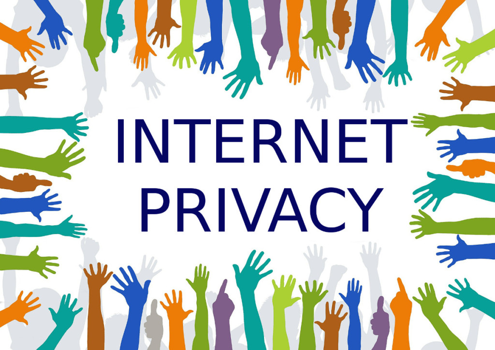

# 第09周

引言
====

工作生活中，我会在互联网上阅读到大量文章，好的文章读完让人受益匪浅。过去我只是认为他们写得好，然后收藏起来，很少在读。这不免是一种资源浪费。所以为了更深度的获取知识，我打算以每周总结的方式激励自己进一步阅读它们。

地理
====

克什米尔
--------

克什米尔是位于南亚最北端的一个地区。19世纪中期之前，“克什米尔”一词仅指代喜马拉雅山脉和比尔本贾尔岭之间的河谷地，而今日则广泛覆盖由印度控制的查谟-克什米尔邦（细分为查谟、克什米尔及拉达克）、由巴基斯坦控制的阿扎德克什米尔和吉尔吉特-巴尔蒂斯坦，以及由中华人民共和国控制的阿克赛钦和喀喇昆仑走廊。（[维基百科](https://zh.wikipedia.org/wiki/%E5%85%8B%E4%BB%80%E7%B1%B3%E5%B0%94)）

参考阅读：[克什米尔地区现在到底由哪个国家统治？（知乎）](https://www.zhihu.com/question/34564913/answer/140548213)

藏区划分
--------

在藏族的传统历史地理概念中，把整个藏区分成三大部分：“上阿里三围，中卫藏四茹，下多康六岗”。

藏族人自己认为今日以拉萨市为中心的西藏是藏族的中心，所以叫“卫”（dbul），以日喀则为中心的雅鲁藏布江流域地区叫“藏”（gtsang），将东部以横断山区为中心的地区当作边远地区，故称“康（khams）”，把居住在这些不同地区的藏族人叫康巴、藏巴、安多娃等。

其实这些不同名称的藏族群体也还包含着一些不同特点的亚文化内容，这便是我们常说的“人域康巴”、“马域安多”、“法域卫藏”。历史上卫藏地区是佛教起源之地，也是藏传佛教的圣地；安多地区自古以来以牧为主，马实际上代表了牧业文化。“康区的人”似乎不可思议，但细想也不难理解，康巴人以长得帅，打仗勇敢，经商有方而闻名全藏。这也许可以算作是藏族文化的一个特点，即把一个地区或国家群体的名称同当地的文化联系起来。

参考阅读：

[藏区并不神秘，为何你依然所知甚少？（地球知识局）](https://mp.weixin.qq.com/s/lpn_9STfbSyVCeLKcGeQUg)

[西藏地名中，“卫”、“藏”、“康”各有什么含义？（知乎专栏）](https://zhuanlan.zhihu.com/p/52301151)

[格勒. 藏学、人类学论文集（上下册）[M]. 中国藏学出版社,
2008](https://book.douban.com/subject/3349987/)

越南舰港上的金桥
----------------

在越南岘港附近的巴拿山，有一座金色桥梁被一双“佛手”举在海拔1400米的半空中。这座桥叫金桥，2018年夏天开始通行，因其独特的造型与周边景色完美地融合在一起，人们纷纷前往自拍。值得称赞的是，这双巨手并非采用石头雕刻，而是用钢网搭制骨架，并用玻璃纤维制作完成。据报道，这座桥梁的建筑师目前正在建造一座银色的姊妹桥。（[必应美图](https://www.nicebing.com/item/20180929)）

交通
====

香港地铁的彩虹色
----------------

香港地铁开通初期，即1970年代尾至80年代初，当列车驶进隧道，乘客便不知身在何区，而当时香港市民教育水平不高，不认得站名的乘客，便可凭月台颜色，分辨出自己身处何站。因此，第一代地铁设计师十分贴心，没有两个相连车站是相同颜色的，而且对比强烈。时至今天，当车厢内挤满人，或只顾低头玩手机，只要抬头一看，便知到站了没有。（[Metropop](https://www.metropop.com.hk/%E6%9C%88%E5%8F%B0%E4%B8%8A%E7%9A%84%E8%89%B2%E5%BD%A9)）

参考阅读：

[港铁总建筑师解构车站87色太子站隐含贵族色彩](https://topick.hket.com/article/1517685/%E6%B8%AF%E9%90%B5%E7%B8%BD%E5%BB%BA%E7%AF%89%E5%B8%AB%E8%A7%A3%E6%A7%8B%E8%BB%8A%E7%AB%9987%E8%89%B2%E3%80%80%E5%A4%AA%E5%AD%90%E7%AB%99%E9%9A%B1%E5%90%AB%E8%B2%B4%E6%97%8F%E8%89%B2%E5%BD%A9)

[在香港，不得不提的是香港地铁](https://zhuanlan.zhihu.com/p/19717393)

[Why every Hong Kong MTR station is a different
colour](https://www.scmp.com/lifestyle/travel-leisure/article/2051751/why-every-hong-kong-mtr-station-different-colour-reason-may)

中国为金正恩越南之行保驾护航
----------------------------

外交部发言人陆康在例行记者会上表示，朝鲜最高领导人金正恩前往越南途中，中国政府将为其提供全程交通支持。（[China.org](http://www.china.org.cn/world/2019-02/27/content_74508659.htm)）

中国铁路车次编号规则
--------------------

车次的编制和上行下行有关，铁路规定进京方向或是从支线到干线被称为上行，反之离京方向或是从干线到支线被称为下行。

上行的列车车次为偶数（双数），下行的列车车次为奇数（单数）。如T11次是从北京开往沈阳北方向，为下行所以是奇数（单数）的；它的回头车T12次是从沈阳北开往北京方向，为上行，所以是偶数（双数）的。另外还有的车在运行途中会因为线路上下行的改变而改变车次。（[百度百科](https://baike.baidu.com/item/%E4%B8%AD%E5%9B%BD%E9%93%81%E8%B7%AF%E8%BD%A6%E6%AC%A1%E7%BC%96%E5%8F%B7%E8%A7%84%E5%88%99)）

自助取票机
----------

自助取票机都是倾斜式的，逼着你在取票时要用手按住身份证，这样走时就不会忘了身份证。如果是平放的话，肯定会有很多人在取票时忘拿身份证。（[即刻](https://m.okjike.com/originalPosts/5c725081bd097b00197e1c8a)）

社会
====

为什么中国政府压迫数百万穆斯林
------------------------------

“一带一路”倡议是中国提出的巨型贸易项目。该项目旨在通过新的基础设施建设，将中国与其他国家联系起来。

项目的很多部分都需经过新疆地区，这里居住着大量的维吾尔族穆斯林。虽然北京一直以“以打击反恐”的名义在打压新疆维吾尔族人民的生活，但是专家称这实际上是为了保护一带一路项目。（[Business
Insider](https://www.businessinsider.com/map-explains-china-crackdown-on-uighur-muslims-in-xinjiang-2019-2)）

香港的今天，会不会是深圳的明天？
--------------------------------

日前公布的数据显示，2018年深圳GDP按美元平均汇率计，超过香港。这意味着深圳有史以来第一次成为华南地区经济总量最大的城市，也第一次成为仅次于上海、北京的“大中华区”第三城。

距离3月5日还有不到一周。四十年前，1979年3月5日，国务院批复广东宝安县改设深圳市，要再过一年半，1980年8月26日，深圳经济特区才告成立。满打满算，深圳还未满四十周岁。在不到四十年里，深圳从一个南海边的小渔村成为世界第二大经济体的第三大都会，它的“奇迹效应”，全世界都看得见。（[元淦恭说](https://mp.weixin.qq.com/s/84u0y6Em7tlWrVRCMqf-Ng)）

好不容易记住的拼音，这下又要重新学？
------------------------------------

因为较多人读错而做出的诸如此类汉语拼音修改，近日通过中国播音主持网的一篇《播音员主持人请注意，这些字词的拼音被改了！》热传，不少网友反映，自己小学时费尽全力才记下的读音，这一次被证明自己又一次做错了。

除了上述内容，还有一些读音如，“说服”的“说”原读“shui”，现读“shuo”。“粳米”的“粳”由“jing”改为“geng”。《中国新闻周刊》就此发函致教育部新闻办提出采访，其回应称，有消息会公布在语言文字应用管理司的网页上。而争议愈加放大之后，教育部相关部门回应媒体称，“改后的审议表尚未通过审议，还应以原读音为准”。相关研究员对外表示，该篇网传文章的杜撰成分很高。（[中国新闻周刊](https://mp.weixin.qq.com/s/8nowGs6TaXnMLklDcV9Jcw)）

新版语文教材确认删除《陈涉世家》
--------------------------------

语文教材总主编确认教育部统一编订初中语文教材删除了《陈涉世家》《石壕吏》等文章，语文教材总主编温儒敏称这是正常变动，表示
“删除”
这一说法不准，这是新版教材，目前尚未出版。“那么多的课文，采用哪些篇目，不采用哪些篇目，这很正常。”他说。

《陈涉世家》为司马迁给陈胜写的小传，留下了
“王侯将相宁有种乎”等名句，《陈涉世家》进入官方教科书至晚可以追溯到 1960 年，1960
年发行的 “九年一贯制试用课本”
第十六册，课文标题是《陈涉世家》。（[科技行者](https://www.solidot.org/story?sid=59678)）

我们为什么哀悼胖鸟的倒下？
--------------------------

昨晚的影迷群里，震惊和遗憾弥漫胖鸟404了，步上了思路、射手等先烈的后尘。抽离地看，这是众多“资源站”难以逃避的终极命运，而接受法律的制裁，似乎也无可厚非。不过，问题的关键是，盗火者之所以存在，还不是由于此间缺少光明？（[枪稿](https://mp.weixin.qq.com/s/E6DbBS2N9hUvayUFBNc6Zg)）

国际
====

2019年奥斯卡金像奖
------------------

最佳影片：《绿皮书》(Green Book)

最佳导演：阿方索·卡隆(Alfonso Cuarón) 《罗马》(Roma)

最佳男主角：拉米·马雷克(Rami Malek) 《波西米亚狂想曲》(Bohemian Rhapsody)

最佳女主角：奥利维娅·科尔曼(Olivia Colman) 《宠儿》(The Favourite)

最佳男配角：马赫沙拉·阿里(Mahershala Ali) 《绿皮书》(Green Book)

最佳女配角：雷吉娜·金(Regina King) 《假若比尔街能说话》(If Beale Street Could
Talk)

（[纽约时报中文网](https://cn.nytimes.com/culture/20190225/oscars-list/)）

参考阅读：

[奥斯卡再遭群嘲：到底是谁在滥用“政治正确”？](https://www.jiemian.com/article/2908790.html)

[《绿皮书》能让我们对黑人电影改观吗？](https://www.douban.com/note/708682449/)

[奥斯卡2019：中国芒果TV抹去同性恋字眼惹争议](https://www.bbc.com/zhongwen/simp/chinese-news-47383229)

[Bao与华人文化：当奥斯卡奖给了80后华裔女导演](https://www.bbc.com/zhongwen/simp/world-47406469)

[MeToo与奥斯卡：一年过去了，女导演仍然稀缺](https://www.bbc.com/zhongwen/simp/world-47327674)

彭博最健康国家指数
------------------

2019 年彭博最健康国家指数对比了 169
个经济体的各项健康指标，包括寿命、健康风险（吸烟和肥胖都是减分因素）、环境因素（例如清洁饮用水及下水设施）、死亡原因、营养不良等。

该榜单显示，与 2017
年的排名相比，西班牙上升五位名列榜首。日本上升了三位，取代新加坡成为最健康的亚洲国家。澳大利亚下滑了两位，从第五跌到了第七。

亚洲方面，韩国进步幅度最大，排名上升了七位，排在第 17。中国的排名从第 55
名升至第 52 名，预计到 2040
年中国的平均寿命将超过美国。彭博认为这就是中国排名增加的原因。数字显示西班牙人的寿命是欧盟中最高的。预计到了
2040 年，其人均寿命将达到 86
岁。（[彭博](https://www.bloomberg.com/news/articles/2019-02-24/spain-tops-italy-as-world-s-healthiest-nation-while-u-s-slips)）

二次世界大战殇示
----------------

1.这个短片是用数字可视化技术动态演示二战的战损情况

2.有几个有意思的对照。德国东部战死人数差不多是西部的5倍

3.中国牺牲上千万生命对日本造成的损失远不如美国牺牲十几万的成果

4.二战是历史上死亡最多的战争。片中所谓的「长期和平」其实说是欧美更恰当

参考阅读：

微博：*https://weibo.com/5872636712/HizKaoMUA*

原始视频：<https://www.youtube.com/watch?v=DwKPFT-RioU>

翻译视频：<http://www.acfun.cn/v/ac4977222>

数据官网：*http://fallen.io/*

人物
====

首富，人设全崩了
----------------

“用户隐私”这根红线不要碰@马克•扎克伯格

“一条推特引发的血案”@埃隆•马斯克

成也iPhone，“败”也iPhone @ 蒂姆•库克

一场离婚引发的混乱 @杰夫·贝索斯

（[硅兔赛跑](https://mp.weixin.qq.com/s/ULFp-0bkP7NK8SSugFQ8cw)）

马斯克激进冰冷，特斯拉犹如邪教
------------------------------

在特斯拉工作是一种怎样的体验？

一位员工的的自述，无比鲜活的告诉了我们答案。这篇自述通过种种细节，描绘出一个犹如邪教一般的特斯拉公司。在马斯克的影响下，这个公司上下极其激进、残酷冰冷、毫无感情，你的工作不仅压力超级大，而且很有可能因为表现不好被开除。当然如果你表现卓越，也会得到不菲的奖励。

听起来就像是在地狱工作，但这位员工为什么还没辞职？他说没有比特斯拉更让他满足的工作了。“你觉得不可能的事情吗，在这里都是有可能的。你觉得他对你要求严吗，他对自己要求更严。这里是type
A的天堂啊。”他说供职于特斯拉除了让人在事业上飞速成长，给他最好的启发是：生活还有工作都要有信念感。（[量子位](https://mp.weixin.qq.com/s/4tGyV-c4dM8qySg9nr_9GQ)）

出身清华姚班，斯坦福博士毕业，她的毕业论文成了「爆款」
------------------------------------------------------

很少有人的博士论文能够成为「爆款文章」，但陈丹琦做到了。这位近日从斯坦福毕业的计算机科学博士引发了人们的广泛关注。据斯坦福大学图书馆介绍，她长达
156 页的毕业论文《Neural Reading Comprehension and
Beyond》上传仅四天就获得了上千次的阅读量，成为了斯坦福大学近十年来最热门的毕业论文之一。（[知乎专栏](https://zhuanlan.zhihu.com/p/57917538)）

Dave 和 Magadeth
--------------

1983年，有支乐队跟唱片公司签了约，马上就要出第一张专辑了。在这个时候，乐队决定开掉吉他手。于是有一天清晨，吉他手从梦中醒来，就收到了一份“大礼”——
一张打包回家的车票。

在从纽约回洛杉矶的一路上，吉他手都在非常痛苦地思考发生的一切。他写了那么多歌，为乐队做了那么多贡献，而其他人居然毫无预警地在录音前踢走了他！他怀疑自己是不是有问题，是不是再也没有机会了……

这是一次漫长而痛苦的反思。等吉他手真正回到洛杉矶的时候，他已经痛定思痛，下定决心要重新奋起。他发誓要重新组建一支乐队，要带着这支乐队取得无以伦比的成功，要让之前的伙伴看到他接受万人欢呼，而他们只能流下悔恨的眼泪。（[微博](https://weibo.com/1783475181/HhYIAv5hl)）

死刑犯三次幸免于难
------------------

故事发生在1992年的非洲马拉维，本文的主人公叫拜森·考拉（Byson
Kaula）。拜森当时40出头，他不幸被判处死刑，但三次都是因为执行绞刑的人实在太累了而幸免于难，真的可以说是大难不死。但这一切到底是怎么回事呢？（[BBC中文网](https://www.bbc.com/zhongwen/simp/world-47360822)）

看完这些70岁老人的遗憾，我啥都想开了
------------------------------------

我想给你看几个特别精彩，特别“春天”的故事。来自一个日本综艺，《爆笑！明石家秋刀鱼的长寿大奖赛》。一帮平均年龄
80岁的长寿老人，对 20
多岁的自己喊话。他们在人生的尽头，回头去看年轻时的困扰：长得丑、怕秃头、离婚、工作业绩不好，同时被
3
个男人追求不知道嫁哪个……但到了一定时间，你总会想开的。（[新世相](https://mp.weixin.qq.com/s/wGc4yv1GbMwJ0webmqXr5g)）

科技
====

短信复活
--------

在移动社交软件的凶猛冲击之下，无论是企业通讯还是生活社交，曾经一度居于国民主流社交应用位置的短信，似乎已经「死」过一次了。短信失落、微信崛起，无疑是移动通讯工具的一次跨世代更迭。（[Tech星球](https://mp.weixin.qq.com/s/aKeCvTogrSS0dEm3rs5WKQ)）

然而，及至2018年，手机短信却在乏人瞩目的环境中逆势上扬。工信部公布的数据显示，2018年，短信业务量大幅度提升了14%，从而一扫多年颓势局面；2019年春节假期，全国移动短信发送量133.3亿条，同比增长7.7%。

可折叠手机
----------

2月28日，世界移动通信大会在巴塞罗那落下帷幕。可折叠屏幕和支持5
G的终端设备是今年巴塞罗那移动通大会上的最大亮点。（[德国之声](https://www.dw.com/zh/%E4%B8%96%E7%95%8C%E7%A7%BB%E5%8A%A8%E9%80%9A%E4%BF%A1%E5%A4%A7%E4%BC%9A%E4%B8%8A%E7%9A%84%E6%8A%98%E5%8F%A0%E6%89%8B%E6%9C%BA%E5%92%8C5g%E6%8A%80%E6%9C%AF/g-47744495)）

Hulu的名称来源
--------------

Hulu，名字源于中文“葫芦”的发音，是一个付费观看正版影视节目的互联网网站。其的名字起源于中文中的两个词语“葫芦”和“互录”。网站的官方博客曾经这样解释：

在普通话中，“hulu”这个词有两层非常有趣的意思，每层都与我们网站的宗旨息息相关：表层的意思是“葫芦”。在古代，葫芦被视作一件有魔力的，能够储藏珍贵物品的容器。深层的意思则是“互录”，即互相录制的简称。我们觉得，两个词语都很好的诠释了我们当初创建网站的目的。（[维基百科](https://zh.wikipedia.org/wiki/Hulu)）

OneWeb 发射其首批互联网卫星
---------------------------

OneWeb
在法属圭亚那使用俄罗斯的联盟号火箭发射了其互联网卫星星座的第一批六颗卫星。和
SpaceX 一样，OneWeb
也计划在发射上千颗卫星，建立一个覆盖全球的卫星星座，将高速互联网连接带到世界的各个角落。

OneWeb 表示它现在具有先发优势。如果这批卫星运行顺利，OneWeb
将从年底开始大规模部署其卫星星座的其余部分，每个月发射 20 枚联盟火箭，每次发射
32-36 颗卫星。覆盖全球需要 648 颗卫星，OneWeb 计划最终发射 2000 颗左右。（[BBC](https://www.bbc.com/news/science-environment-47374246)）

研究发现人们担心隐私但并不愿意采取行动
--------------------------------------

根据 IBM
的一项隐私调查，人们确实对隐私越来越关心了，然而他们并没有因此愿意采取行动。调查显示，81%
的消费者表示他们关心企业如何使用数据，87%
的消费者认为需要严格监管个人数据管理，75%
的人认为他们不太信任拥有其数据的公司，89%
的人表示企业在产品如何使用数据上需要更明确。

与此同时，71% 的人表示愿意放弃隐私换取服务，45% 的人修改了产品的隐私设置，16%
的人因数据滥用而选择离开。显而易见，大数据泄露对企业财务风险很小，即使有数据大规模泄漏，企业也无需担心，因为大多数人仍然会继续用他们的服务。（[科技行者](https://www.solidot.org/story?sid=59697)）

用八年级的数学来理解机器学习
----------------------------

对于人工智能的解释，要么被媒体过分夸大，要么被科学家用学术名词描述得无法理解。但从根本来说，经典的AI就是任何来模仿人类智力的东西。我们可以看到机器学习其实是属于人工智能范畴的，但是什么是「学习」呢？

最简单的解释就是y=mx+b，由输入x得到输出y。只不过机器更擅长处理人类不能处理的数据罢了，所以我们会给机器大量的数据进行训练。（[Medium](https://medium.com/s/story/machine-learning-for-anyone-who-took-math-in-8th-grade-60fa9198b5eb)）

加州大学10校抵制最大学术出版商
------------------------------

爱思唯尔(Elsevier)，地球上最大学术出版商之一。每年有数十万的前沿论文，最终发表在爱思唯尔旗下的期刊上，其中包括《细胞》、《柳叶刀》等。现在，爱思唯尔遭受了史上最大规模的抵制。

整个加州大学 (UC)
系统宣布，全部10个分校（包括伯克利分校、洛杉矶分校、圣地亚哥分校等），都不再继续订阅爱思唯尔、一刀两断。双方耗时八个月的谈判彻底破裂。爱思唯尔始终无法满足UC提出的两大目标：一是，把UC在爱思唯尔发表的所有研究，向全世界的读者免费开放；二是，控制学校订阅期刊的成本，这项支出增长太快。（[量子位](https://mp.weixin.qq.com/s/TIJotlDmEtD1MXrECx9P1A)）

生物
====

罕见的半同卵双胞胎
------------------

「半同卵双胞胎」，英文叫semi-identical twins 或者sesquizygotic
twins，介于同卵双胞胎和异卵双胞胎之间。这是一种极其罕见的情况，由于本来发生的几率就很小，即使发生了，很多也只是被当做普通的双胞胎。

根据检查结果推算，这对双胞胎身上可能发生了这样的事：

1.同一个卵子被两个精子受精，这样的三倍体一般会自然夭折。然而，有的三倍体受精卵却神奇地硬是继续配对分裂下去。

2.来自母亲的基因是M，来自父亲的基因是P₁和P₂，结合成三倍体MP₁P₂。各自复制，变成MMP₁P₁P₂P₂。然后形成三极纺锤体，分裂成三种二倍体细胞，MP₁、MP₂、和P₁P₂。

3.在接下来的生长中，纯父系细胞的P₁P₂处于弱势，竞争不过MP₁和MP₂，慢慢就没了。最后长起来的囊胚里，细胞基本是MP₁和MP₂。

4.然后，这个嵌合体囊胚又按照正常同卵双胞胎的路线分裂成两个胚胎，长成了共用胎盘和绒毛膜的双胞胎。（[果壳](https://mp.weixin.qq.com/s/vO3SNqKT3-viIDeO5wrtAg)）

全球最大药企辉瑞170年简史
-------------------------

有着170年历史的辉瑞（Pfizer)，是全球处方药销售规模最大的药企。辉瑞堪称现代制药行业的缩影：坚定地投入药物研究，忧心忡忡地开启多样化业务，用并购来弥补阶段性的科研短板，“做大做强”获得更多收入来支撑研发。

但是现在，整个制药行业都开始面对一个新难题：德勤2018年12月的研究显示，2010年以来，生物制药公司的研发回报率节节下滑，2018年头部12家药企的回报率降低到只有1.9%。（[华尔街见闻](https://wallstreetcn.com/articles/3482129)）

含8个碱基的DNA首次合成
----------------------

DNA 包含 4 个碱基，现在美国科学家将其数量增加了一倍，首次合成出包含 8 种碱基的
DNA。实验表明，合成 DNA 看起来能像天然 DNA
一样存储和转录信息，这可能也意味着宇宙中存在其它生命形式。研究报告发表在《科学》期刊上。

研究人员通过调整普通碱基——鸟嘌呤、胞嘧啶、腺嘌呤和胸腺嘧啶（G、C、A、T，其中 A
与 T 配对、C 与 G 配对）的分子结构，创建出两对新碱基：S 和 B、P 和
Z。新碱基的形状与天然碱基类似，但结合方式不同。随后，他们将合成碱基与天然碱基结合，得到了由
8 种碱基组成的
DNA。（[科学网](http://news.sciencenet.cn/htmlnews/2019/2/423188.shtm)）

效率
====

云音乐歌曲封面下载
------------------

输入歌曲链接，即可获取歌曲封面，非常简单实用。

在线地址：<https://dev.yii2.cc/cover>

一流成功人士都是如何管理时间的？
--------------------------------

我们寻求工作与生活的平衡，但似乎永远没有足够的时间来做到这一点。然而我们都知道，那些一流成功人士在一天内容完成的事情比我们要多得多，他们并没有所谓的神奇的力量。那么问题来了：那些一流成功人士究竟是如何管理时间的呢？（[36氪](https://36kr.com/p/5181753.html)）

阮一峰：每周分享第 45 期
------------------------
（[阮一峰](http://www.ruanyifeng.com/blog/2019/03/weekly-issue-45.html)）

**阿西莫夫的故事启示**：如果退休以后，还想有稳定的收入保障，最好的方式就是你必须拥有资产。在阿西莫夫的例子里，就是他拥有版权，版权就是一种产生收入的资产。其他类型的资产包括房产、专利、股权等等。总之，年轻时就必须明确，你的工作目标不完全是高收入，更重要的是必须积累资产。

■

[GitHub年度报告](https://octoverse.github.com/projects#languages)

显示用户国别的前三位分别是美国、中国、印度。比较厉害的是加拿大，只有3千万人口，可以排到第六位。

■

[你应该记住的 DNS
地址](https://danielmiessler.com/blog/dns-servers-you-should-have-memorized/)

作者介绍了几个常用的 DNS 服务器地址，简单谈了它们之间的差异。

■

[计算机科学的自学方案](https://functionalcs.github.io/curriculum/)

本文对于计算机科学各门课程的自学，给出了一个完整的方案。

■

[科技资讯的聚合网站](https://github.com/ruanyf/weekly/issues/259)

该网页聚合多个英文科技咨询网站的消息，一个地方就能看到所有资讯。

[SciUrls.com](https://sciurls.com/) / [TechUrls.com](https://techurls.com/) /
[DevUrls.com](https://devurls.com/)

■

[Last-Statement-of-Death-Row](https://github.com/wansho/Last-Statement-of-Death-Row)

美国得州的政府网站，有该州死刑犯的遗言数据库。有人编写了 Python
脚本，去抓取所有遗言，输出 CSV 文件和文字云。

■

[通过拥有东西致富](http://blog.samaltman.com/how-to-be-successful)

小时候，我对于经济的最大误解是，人们通过高工资致富。实际上，虽然有一些例外（比如娱乐明星），高工资并不足以让你发财，福布斯富豪榜上，几乎没有人是领工资的。

真正富裕起来的人，都是通过拥有某种价值迅速增长的东西而致富。

这种价值迅速增长的东西，可以是股权、房地产、自然资源、知识产权或其他类似的东西。你需要拥有一些这样的东西来获取收入，而不能仅仅依靠出卖自己的时间换取收入，因为时间是一种线性资源。想要要多的收入，只能出卖更多的时间，这对你不利。

使你的东西的价值迅速增长，最好方法就是让大量的人想要你的东西。
