# 第10周

# 引言

工作生活中，我会在互联网上阅读到大量文章，好的文章读完让人受益匪浅。过去我只是认为他们写得好，然后收藏起来，很少在读。这不免是一种资源浪费。所以为了更深度的获取知识，我打算以每周总结的方式激励自己进一步阅读它们。

# 科普

## 我们的祖先是分段睡眠？

在电灯发明之前，人在晚上是分段睡的。

没电灯前，太阳一下山街道就暗下来了，晚上大家一般没事不出门，天一黑就上床睡觉，大概凌晨一两点钟自然醒来。这段清醒时间古人用来祷告、阅读、做爱或者聊天。大约活动一两个小时，再上床接着睡。

科学家发现，夜间的这段清醒时间，大脑会分泌催乳素，这种激素能让我们感觉内心平静，还能促使大脑产生灵感和创意。所以很多人会在半夜工作，比如巴尔扎克就是半夜起床，工作到早上八点再睡。写《变形记》的小说家卡夫卡，也是白天睡觉，晚上工作。

一直到19世纪末期，人们还都是分段睡的。后来电灯发明出来了，晚上活动多了，人们才慢慢放弃了分段睡眠，改成了深夜睡、早晨醒的整段睡眠。现在有人半夜醒来，觉得自己是不是得了失眠啊，其实不用太担心，你只是回到了过去最自然的分段睡眠模式。

所以你看，很多我们习以为常的生活方式并不是自然规律，而是新技术帮我们慢慢形成的。（[得到](http://www.luojiji.com/thread-3542-1-1.html)）

## 杨振宁和李政道的宇称不守恒到底说了啥？

跟前沿理论物理的一大堆让人懵圈的专业术语相比，“宇称不守恒”这五个字看起来还是很亲民的。毕竟我们中学时代就学过能量守恒、动量守恒，对守恒的概念还是很熟悉的，而“宇称”听起来应该和宇宙的某种对称性有关。然而，宇称到底是什么呢？为什么它不守恒？为什么宇称的不守恒会让科学界如此震动，以至于杨振宁和李政道在1956年6月提出了宇称不守恒，1957年的诺贝尔物理学奖立刻颁给了他们？

没错，宇称确实是指一种对称性，要想理解宇称不守恒为什么这么重要，就要先理解为什么对称性这么重要。

那么，对称性到底有多重要呢？这么说吧，如果没有对称性作指导，爱因斯坦不可能发现相对论，当代的理论物理学家们会像失去了灯塔一样集体在黑暗里抓瞎。物理学大师费曼曾经说过，如果让他选择一句话来概括现代科学最重要的发现，他会选“世界是原子组成的”。许多当代最著名的物理学家们认为，如果有机会再选一句，那么所选的将是“对称性是宇宙规律的基础”这句话。（[长尾科技](https://mp.weixin.qq.com/s/Hzi-bmWX52MA0vYWvvr4UA)）

## 俄罗斯“地狱之门”是真的吗？

> 苏联的科学家在西伯利亚的钻探了世界上最深的一处深井，深井在14.4KM之下发生异变。挖掘仪器震动强烈，科学家们惊讶地发现地心内部竟有一个空腔。温度也升至2000度，科学家使用超精度录音机探测，却听到了类似人类的惨叫呻吟声，他们认为自己挖开了“地狱之门”。

这是一则典型的恐怖类都市传说（即毫无事实依据的传言，无稽之谈），故事雏形最早源起自1990年美国宗教节目的“误传”（在节目中援引“某报纸”来证明地狱存在），随后被各个宗教杂志转载，因而衍生出各种各样不同的版本。（[知乎](https://www.zhihu.com/question/20561755/answer/577258951)）

## 为什么会有拖延症？

每个人在生活中的某个时刻都有过拖延。我们会把工作拖延到最后一分钟，我们很容易被周围的事情分心，我们在原地转圈却从不前进。

然后，我们为没有把重要的事情做完而感到难过。看看其他表现更好的人，我们开始相信，我们只是普通人，永远不会取得任何伟大的成就。当你处于这种境地时，你会感到无助和孤独，因为直言不讳只会进一步挫伤你的自尊。

事实上，每个人的感受都是一样的。拖延症不容易克服，因为它不是一个可以用公式计算的数学问题。人们因为不同的原因以不同的方式拖延。因此，在深入研究克服拖延的方法和策略之前，我们首先需要了解为什么我们会拖延。（[Quora](https://www.quora.com/Why-do-people-procrastinate)）

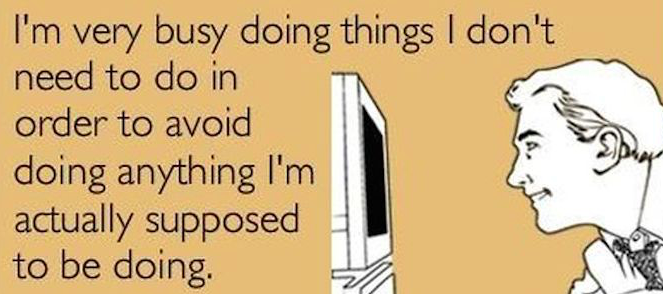

## 房间里的大象

“房间里的大象”，在英文里，意指所有那些触目惊心地存在却被明目张胆地忽略甚至否定的事实或者感受，就是那些“我们知道，但是我们清楚地知道自己不该知道”的事。“皇帝的新装”是个典型的“房间里的大象”，但“皇帝的新装”只是个隐喻。

在一个电视相亲节目中，嘉宾们七嘴八舌地分析某个相亲失败的男人哪句话说错了、哪个表情不当，却绝口不谈他的职业是厨师或者鞋匠的事实，这时候，电视屏幕里站着一只大象。成百上千个人坐在一起煞有介事地开会，但谁都明白这个会只是个橡皮图章而已，在那个会议厅里，同样站着一只大象。（[刘瑜](http://star.news.sohu.com/20150824/n419605341.shtml)）

[维基百科](https://zh.wikipedia.org/wiki/%E6%88%BF%E9%96%93%E8%A3%8F%E7%9A%84%E5%A4%A7%E8%B1%A1)对其定义为：房间里的大象（Elephant in the room）用来隐喻某件虽然明显却被集体视而不见、不做讨论的事情或者叫风险，抑或是一种不敢反抗争辩某些明显的问题的集体迷思。

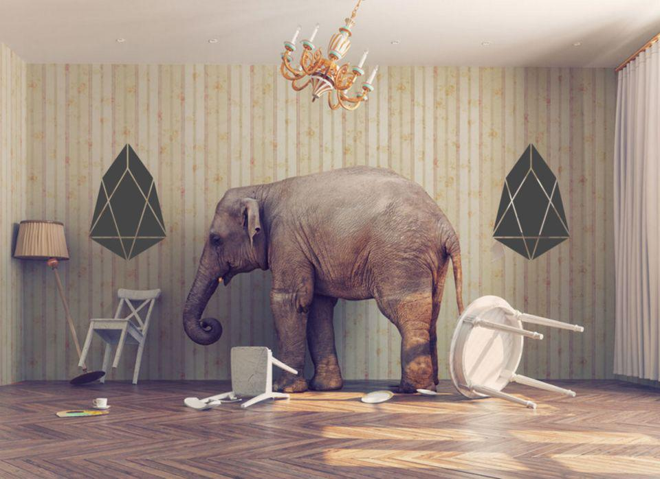

## 善用“阿伦森效应”

曾见过这么一篇短文，说的是某宿舍楼后，停一辆破旧卡车，大院的儿童们每当午休来临，便攀上车厢蹦跳，哆够之声震耳欲聋，众人愈管，众童蹦得愈响，见者无奈。这日，大刘来了，曰：“孩子们，今日你们比赛，蹦得最响者得玩具手枪支。”众童欢呼雀跃，争相蹦跳，优者果然得奖。二日，大刘又来，曰：“今日继续比赛，奖品为巧克力两块。”众童见奖品直线下跌，纷纷不悦，无人卖力去蹦，声音疏而弱。三日，大刘又曰：“今日奖品为花生米一粒。”众童纷纷跳下汽车，皆曰：“不蹦了，不蹦了，真没意思，回家睡觉咯。”

这则故事很有意思，在“正面难攻”的情况下，大刘采用了“奖励递减法”，却收到了意想不到的效果。其实，在社会心理学中，有一个“阿伦森效应”可以很好地揭示上面这则故事的奥秘。其大意是：人们最喜欢那些对自己的喜欢、奖赏、赞扬不断增加的人（或行为、举措等），最不喜欢那些显得不断减少的人（或行为、举措等）。（[MBA智库](https://doc.mbalib.com/view/cf83396bb4bad217afa2ee7c316d11b3.html)）

## 香港人行道的设计细节

香港的人行道红绿灯有个细节设计的很好，除了颜色信号外，红绿灯颜色对应不同的声音信息，对于普通人可以不用找信号灯就够了，对于色盲和盲人来说就是福音了。（[懂点设计](https://weibo.com/3793716231/Hh6rzeqxZ)）

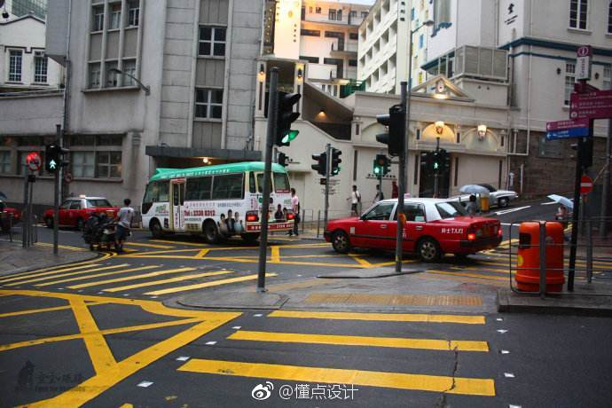

# 图说

## 人大代表信息可视化

全国人民代表大会是国家最高立法机关，是最高国家权力机关。 每年三月，人大代表们从全国各地聚集在中国首都北京，讨论国家大事。（[CGTN](https://news.cgtn.com/event/2019/whorunschina/index.html)、[CNTN America](https://america.cgtn.com/2019/03/04/who-runs-china)）

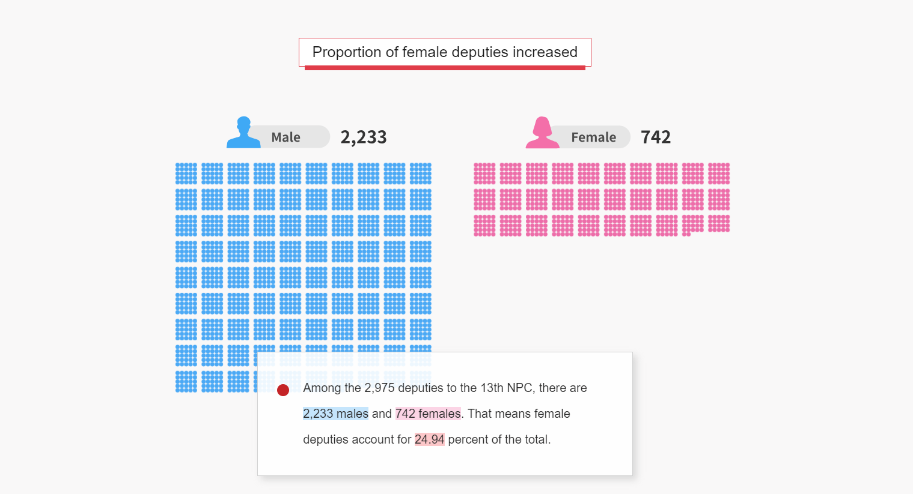

## 你还认识十年前的这些网页吗？

随着“10年挑战”在互联网上迅速传播，我想看看过去10年互联网上一些访问量最大的网站发生了什么变化。（[阅读原文看更多网站变化](https://www.arun.is/blog/10-year-challenge/)）

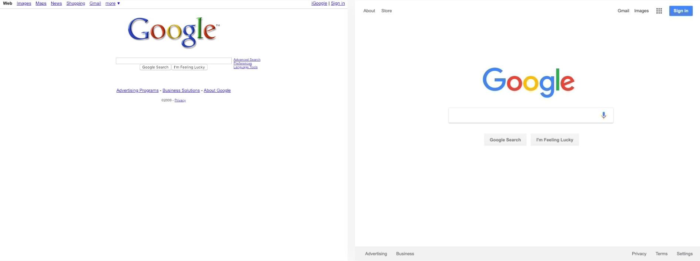

Google

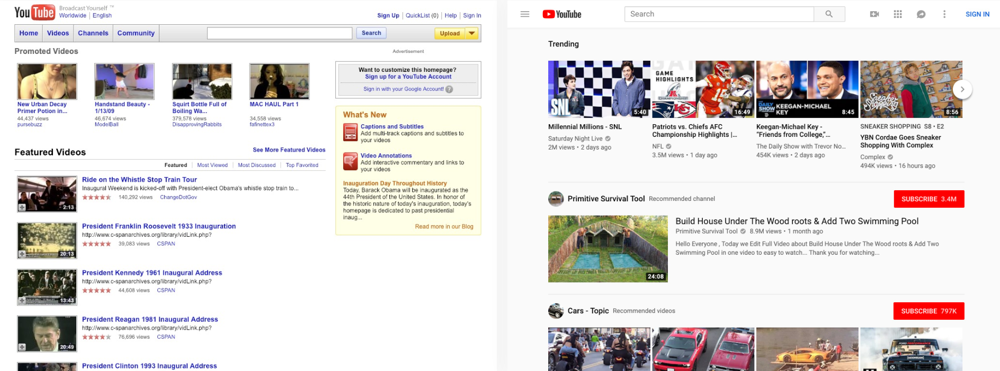

Youtube

## 香港穷人的“蜗居”

穷人被香港的虚高的房价压得喘不过气，违规建造的隔离小屋成了他们的家。根据社区组织协会的数据，估计有20万香港居民居住在这种简陋住房中。（[National Geographic](https://www.nationalgeographic.com/photography/proof/2017/07/hong-kong-living-trapped-lam-photos/)）

# 排名

## 福布斯2019亿万富豪榜

纽约当地时间3月5日，福布斯发布第33期年度[全球亿万富豪榜](https://www.forbes.com/billionaires/#7fb6a118251c)，列出了全球最富有的人士。整体来看，2019年，共有2153位身价达到10亿美元的亿万富豪上榜，较2018年（2208位）减少55位。这是2016年以来富豪人数首次下降。

福布斯财富内容助理管理编辑Luisa Kroll说：“富豪榜证明，面对经济的力量和全球市场的波动，即使是世界最富有的人群也不能不受影响。不过，虽然有巨大阻力，但是足智多谋、坚忍不拔的创业者总能走出创富的新路。”

值得一提的是，在排名前20的富豪中，有且仅有一位来自中国。来自腾讯公司的董事会主席兼首席执行官马化腾，以388亿美元的身家跻身前20，马云则未出现在前20榜单中。（[全天候科技](https://awtmt.com/articles/3488373)）

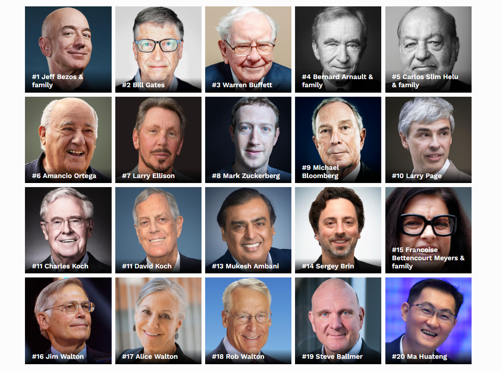

## 移动数据流量费用全球排名

英国比价网站 Cable.co.uk 的一项研究发现，印度的移动数据流量费率全球最便宜。印度每 GB 数据平均费用仅为 0.26 美元，而英国是 6.66 美元，美国是 12.37 美元，中国是 9.89 美元（不同地区有差异）。

这项研究对比了 230 个国家的移动数据费用，全球每 GB 数据的平均费用为 8.53 美元。最便宜的五个国家是印度、吉尔吉斯斯坦、哈萨克斯坦、乌克兰和卢旺达；最贵的五个国家是津巴布韦（75 美元/GB）、赤道几内亚、圣赫勒拿岛、福克兰群岛和吉布提。中国排在 165 位。（[Cable](https://www.cable.co.uk/mobiles/worldwide-data-pricing/)、[科技行者](https://www.solidot.org/story?sid=59785)）

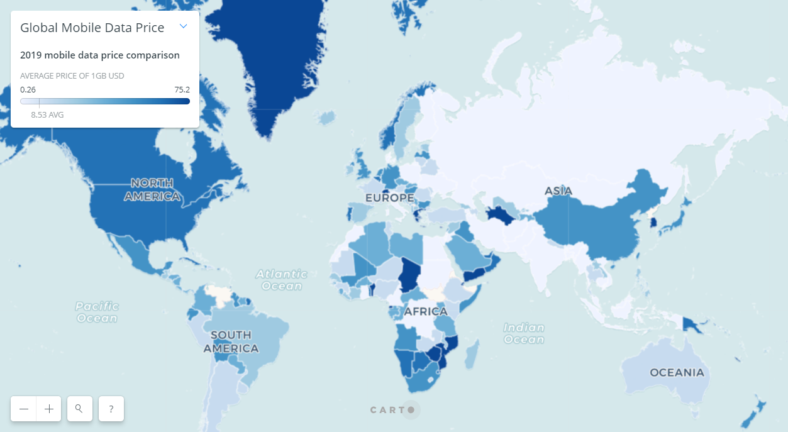

## 2018世界空气质量排名

绿色和平及 AirVisual 发表[《2018 年世界空气质量》报告](https://www.airvisual.com/world-most-polluted-cities)，中国的空气质量明显好转，而污染最严重的城市大部分在印度。北京不再位居空气污染最严重的的 100 个城市之列。

空气污染最严重的前两座城市都来自新疆，一个是和田，一个则是喀什。阿克苏排在第 5 位。北京附近的河北省也是重灾区，邢台、保定、邯郸以及省会石家庄都在空气质量最差的十个城市的榜单上。([科技行者](https://www.solidot.org/story?sid=59793))

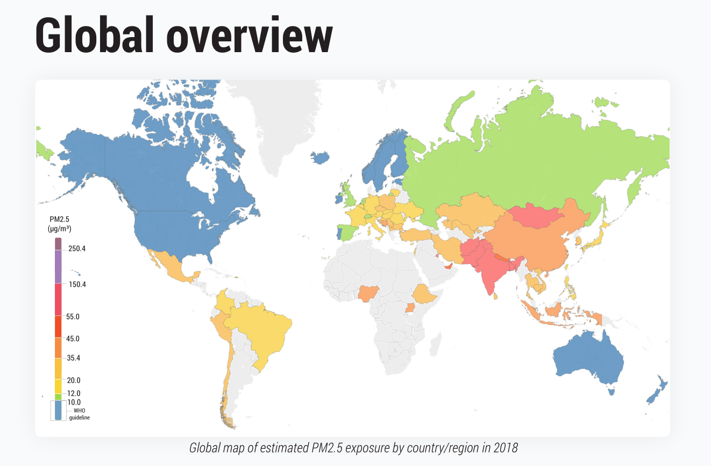

# 中国

## 放开生育政策为时已晚

2018 年中国的人口出生率大幅降至 10.94‰，新生儿人数降至 1523 万人。北京大学经济学教授梁建章和他的同事曾预测出生人数在 2017 年到顶，2018 年开始下滑。结果是 2017 年出生率就开始下滑了，他现在预言中国未来新生儿人数不会再超过 1500 万。

长期批评中国计划生育政策的威斯康星大学科学家 Yi Fuxian 说，中国应该在 28 年前就停止独生子女政策，现在已经为时过晚了。人口学家警告中国从下一个十年开始人口将会出现收缩，到 2050 年三分之一的人口将会超过 60 岁，政府服务和家庭的负担将会加重。（[The Guardian](https://www.theguardian.com/world/2019/mar/02/china-population-control-two-child-policy)、[科技行者](https://www.solidot.org/story?sid=59762)）

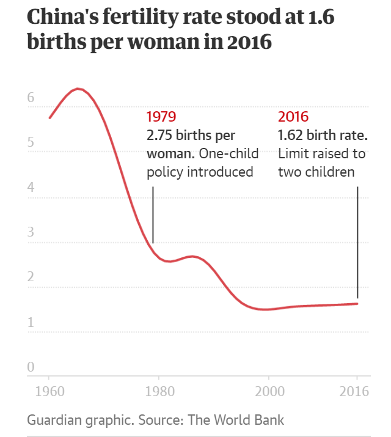

## 三种地缘政治学说与“一带一路”倡议

百年来，地缘政治学家提出三种理论，从地理角度描述如何控制世界：美国马汉的“海权论”认为，谁控制了海洋，谁就控制了世界；英国麦金德的“心脏陆地说”认为，谁控制了欧亚大陆，谁就控制了世界；美国斯皮克曼的“陆海边缘地带说”认为，谁控制了海陆交界处，谁就控制了世界。

前不久，美国前白宫战略顾问班农认为，中国“一带一路”倡议集三种理论于一身，试图借此控制世界，各国必须加以抵制，诸如此类。应指出的是，三种地缘学说与“一带一路”倡议有本质的区别，有时空的不同，两者不可同日而语。（[中国国际问题研究院](http://www.ciis.org.cn/2018-11/05/content_40561837.html)）

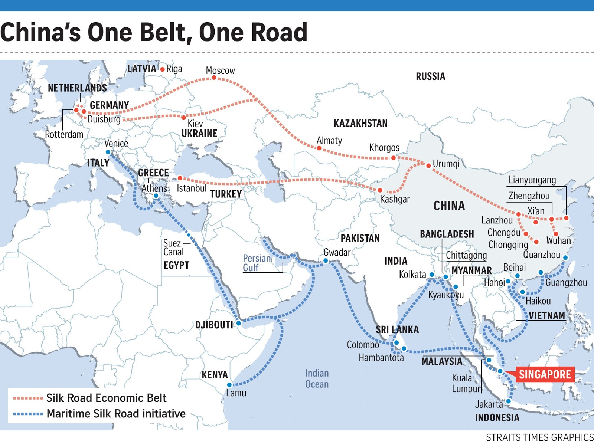

## 中国消失的省份

新中国建国初期；由于历史的原因和新中国行政区划规划的需要，曾保留、新建了一些省、行署区等。后由于形势和建设、管理的实际情况，又相继进行了撒销、合并和降格。

从设立至裁并及降格，时间约从1949年8月至1955年7月。裁并的省8个：平原省、察哈尔省、绥远省、辽东省、辽西省、松江省、热河省、西康省；撤销的地区一个：昌都地区。

（张明庚，中国历代行政区划）

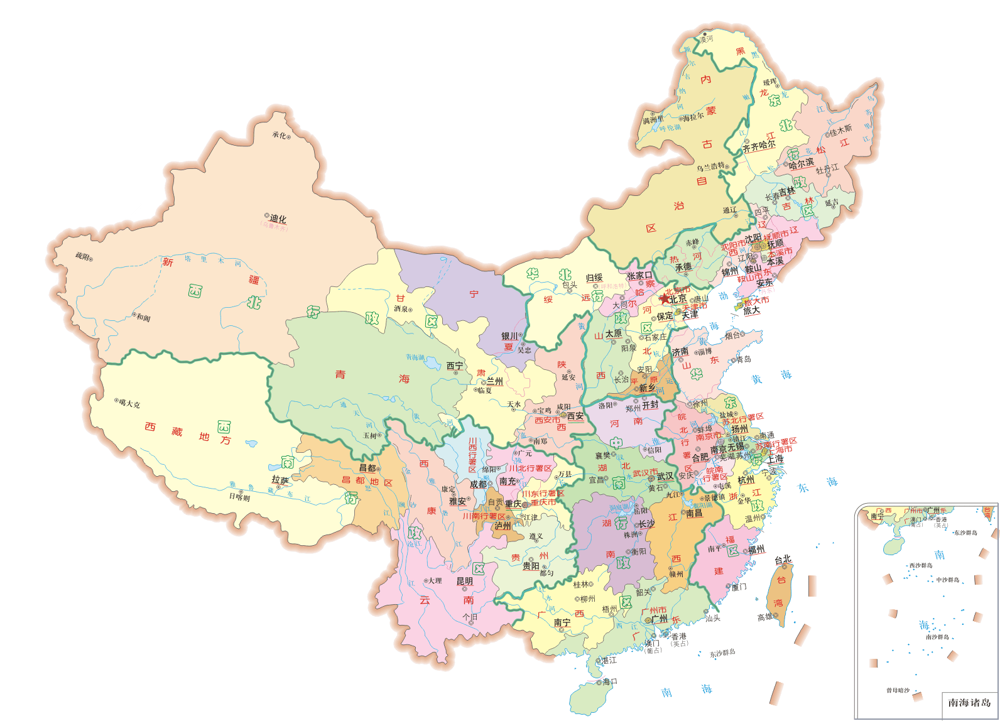

1949年地图（[图片来源](http://www.twoeggz.com/news/1629161.html)）

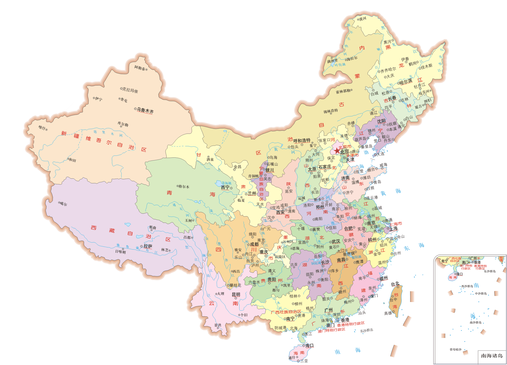

1999年地图（[图片来源](http://www.twoeggz.com/news/1629161.html)）

# 科技

## Deepfake

Deepfake，是英文deep learning和fake的混成词，专指用基于人工智能的人类图像合成技术。此技术可将已有的图像和影片叠加至目标图像或影片上。

Deepfake亦可用来制作虚假的名人性爱影片和报复性色情媒体。带色情成分的Deepfake作品于2017年间在互联网上流出，特别是在Reddit上。这些Deepfake作品现已被Reddit、Twitter和Pornhub等网站禁止发布。Deepfake也可以用以制造假新闻及恶意恶作剧。（[维基百科](https://en.wikipedia.org/wiki/Deepfake)）

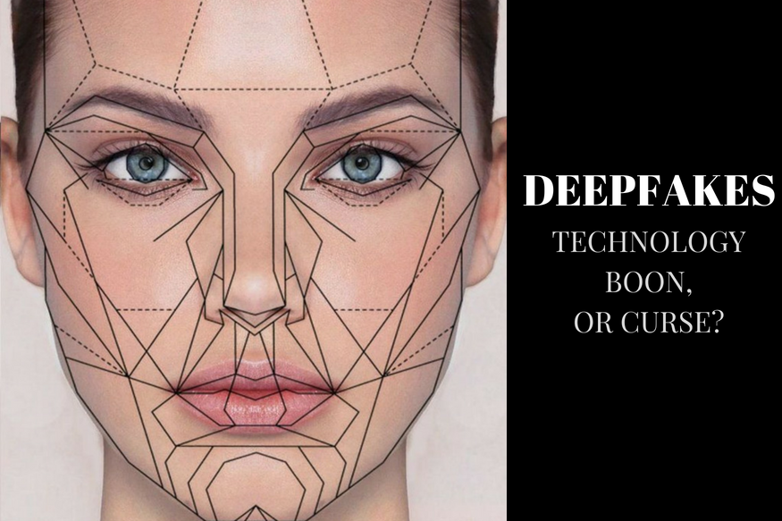

参考阅读

* [Take This Quiz To Figure Out If You Can Tell A Real Face From A Fake One](https://www.buzzfeednews.com/article/janelytvynenko/real-or-fake-face-quiz)
* [如何评价deepfakes用深度学习技术所合成的明星AV?](https://www.zhihu.com/question/264019472/answer/362367330)
* [我把石原里美的脸，合成到日本小短片儿里了](https://mp.weixin.qq.com/s/oXI6DcTan56hJINbrFubgg)
* [你用Deepfakes给小电影换个脸，人脸识别AI也看不出来](https://mp.weixin.qq.com/s/UerJVQ04mOnrk5ZhLawmbA)

## 谷歌中国版搜索引擎项目仍在继续

The Intercept 去年 12 月报道，在内部爆发冲突之后，Google 终止了秘密的审查版中国搜索引擎项目。该审查版搜索引擎项目代号 Dragonfly，是在去年 8 月曝光的，之后在 Google 内部引发了广泛的争议。

Google 雇员调查发现中国版审查引擎项目事实上还在继续。Goolge 雇员跟踪了源码库里 Dragonfly 相关的代码变化，发现去年 12 月有大约 500 次变更，今年 1 月到 2 月有超过 400 次变更。他们发现仍然有 100 名工程师在 Dragonfly 相关项目上工作。（[The Intercept](https://theintercept.com/2019/03/04/google-ongoing-project-dragonfly/)、[科技行者](https://www.solidot.org/story?sid=59768)）

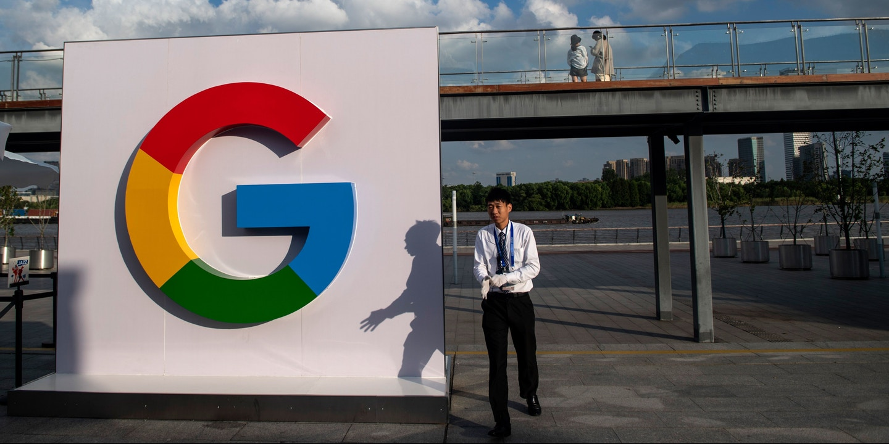

## 在线免费试用Windows

打开后可以临时生成一个 Windows 系统，免费使用 15 分钟，网速快并且可以访问 Google/Youtube 等网站。（[网站地址](https://demo.glyptodon.com/)）

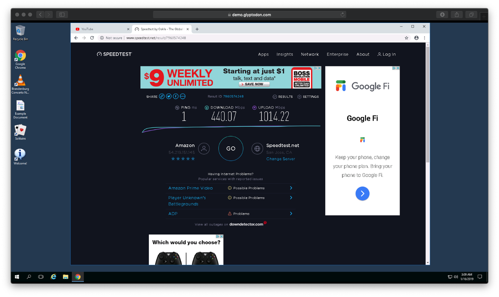

## 看谷歌街景猜地点

[Geoguessr](https://geoguessr.com/world/play)是一款网页地理位置猜测游戏。进入游戏界面会给出一幅谷歌街景地图，玩家可以通过各种方法猜测判断出街景所处的地理位置。

看别人怎么玩：

* [全程高能！地理“鬼才”UP全球定位，几乎0误差](https://www.bilibili.com/video/av35774516)
* [Geoguessr丨给你一张照片你能猜的出来这是哪里吗？](https://www.bilibili.com/video/av24392715)

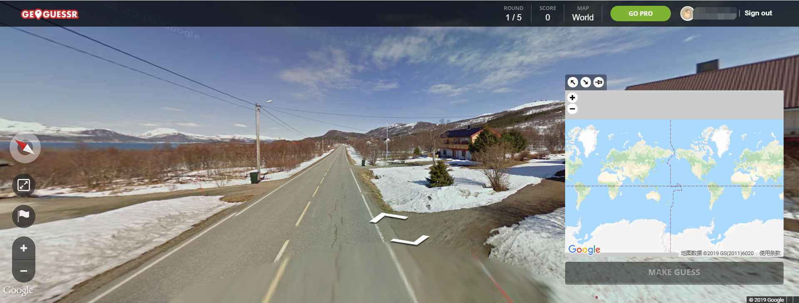

# 文摘

## 阮一峰：每周分享第 46 期

[>>点击阅读原文<<](http://www.ruanyifeng.com/blog/2019/03/weekly-issue-46.html)

[黑客工具课程](https://hacker-tools.github.io/lectures/)
麻省理工学院的入门课程，介绍 Linux 系统使用者需要掌握的各种基本工具，适合刚入门的初级用户。

[数据结构可视化](https://www.cs.usfca.edu/~galles/visualization/Algorithms.html)
该网站收集各种数据结构，并将它们用可视化的形式表现出来。

[芬兰语没有拼写检查](https://linustechtips.com/main/topic/72936-english-swedish-german-and-finnish-decline-dog/)
从来没有软件提供芬兰语的拼写检查。因为芬兰语单词的拼写变化实在太多，下面这些都是"狗"的正确拼写：

> koirasi, koirani, koiransa, koiramme, koiranne, koiraani, koiraasi, koiraansa, koiraamme, koiraanne, koirassani, koirassasi, koirassansa, koirassamme, koirassanne, koirastani, koirastasi, koirastansa, koirastamme, koirastanne, koirallani, koirallasi, koirallansa, koirallamme, koirallanne, koiranani, koiranasi, koiranansa, koiranamme, koirananne, koirakseni, koiraksesi, koiraksensa, koiraksemme, koiraksenne, koirattani, koirattasi, koirattansa, koirattamme, koirattanne, koirineni, koirinesi, koirinensa, koirinemme, koirinenne, koirakaan, koirankaan, koiraakaan, koirassakaan, koirastakaan, koiraankaan, koirallakaan, koiraltakaan, koirallekaan, koiranakaan, koiraksikaan, koirattakaan, koirineenkaan, koirinkaan, koirako, koiranko, koiraako, koirassako, koirastako, koiraanko, koirallako, koiraltako, koiralleko, koiranako, koiraksiko, koirattako, koirineenko, koirinko, koirasikaan, koiranikaan, koiransakaan, koirammekaan, koirannekaan, koiraanikaan, koiraasikaan, koiraansakaan, koiraammekaan, koiraannekaan, koirassanikaan, koirassasikaan, koirassansakaan, koirassammekaan, koirassannekaan, koirastanikaan, koirastasikaan, koirastansakaan, koirastammekaan, koirastannekaan…

[订阅模式让我困扰](https://news.ycombinator.com/item?id=19016729)
我为一些服务支付月费，比如 Netflix、亚马逊、有线电视、电子邮件、备份存储、软件、音乐、健身房会员......。但是，我的生活是"不定期"的，没法知道什么时候会去用这些服务。有些服务我很少使用，为它们支付月费，对我来说很不划算。

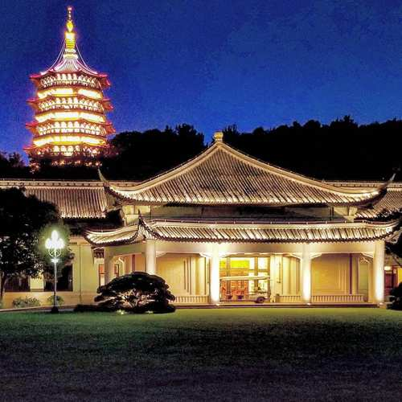

## 我们提供知识，以应对变化的时代。

我觉得时代也许是从来都没有变过吧，作家们早就发现了这一点，人只不过是在重演过去一代又一代的历史而已。你经历的早已有千百万人经历过了，所以读书对我来说，就是认识自己。

月亮与六便士的问题古已有之，肯定不只我一个人在“情怀”和“生存”之间纠结。大部分人都告诉我，如果扣除房租水电、缴税保险、衣食住行等乱七八糟，兜里只有一两千块钱，你还想买衣服，去旅行，去请私教？生场病就全没了。

但是没钱有没钱的活法吧，老师跟我说，挣多少钱算是个头啊。我相信人的欲望是没有止境的，你不想买化妆品新衣服零食奶茶电子产品，就是想旅行健身心甘情愿给猫铲屎。还有，你控制的住自己的生理需求吗，交配和进食的欲望？反正我不行，也许以后皈依佛门了可以。说什么健身是为了锻炼身体、化妆打扮是为了让自己开心，反正对我来说不是，我身体很健康，长相也没有残缺，做这些不就是为了获得优先交配权吗？如果没有欲望，人就不会有那么多痛苦，就不会觉得八千块的工资太少，非得做着自己不喜欢的工作挣一万。

可我毕竟现在还没有这么高的境界是不是？我就算不在乎吃穿，可还是仍然非常想去世界各地，而且读很多书。但仔细想想，我都不知道自己为什么想去旅行，去读书，但是这个愿望仿佛一直就在那里，非常强烈，以至于都成了我的人生目标。也许我不用有很多钱也能走遍世界、读遍群书吧。

也许有一天我会想明白，其实读书和旅行都没什么意义，又或许它们最大的意义就在于，让你明白，人生本来就没什么意义。（张莹炜朋友圈）

## 内容与媒介

1964年，麦克卢汉出版《理解媒介》，正式提出了“媒介即信息”的观点。在他看来，媒介而非媒介承载的内容改变了人类认识、感受世界的方式，相比之下，内容本身给人带来的影响反而是次要的。

麦克卢汉的时代，正值电视兴起，但媒介形式的转变依然不算迅速。但在过去二十多年里，我们经历了互联网和移动互联网两次变革，更能深刻理解麦克卢汉的理论。

移动互联网和手机的出现，让所有人无时无刻不在线上，“低头族”变多，人们获取的内容也更加零散，整个社会都在向着“移动化”转变。这是作为整体的移动互联网而非某个具体的内容带来的改变。

内容发展也总是落后于媒介变革的，在移动互联网早期，人们所看的内容与以往并无不同，依然是文字、图片或者影视作品，只不过以前在电脑上看，如今在手机上看而已，但新的媒介，需要新的内容形态。

新的内容形态是什么样的？我们不妨再回到麦克卢汉的那句话里。“媒介即讯息”的另一层含义是，旧的媒介会成为新媒介的内容（讯息）。比如，图像是电影的内容，电影则是电视的内容，电视则成了互联网的内容。那么以此来看，什么会是移动互联网时代的内容呢？答案自然是在它之前的所有媒介，其中甚至包括使用互联网的人也会成为内容的一部分。（[36氪](https://mp.weixin.qq.com/s/SZEN319aTs1KcsMx91TLMA)）

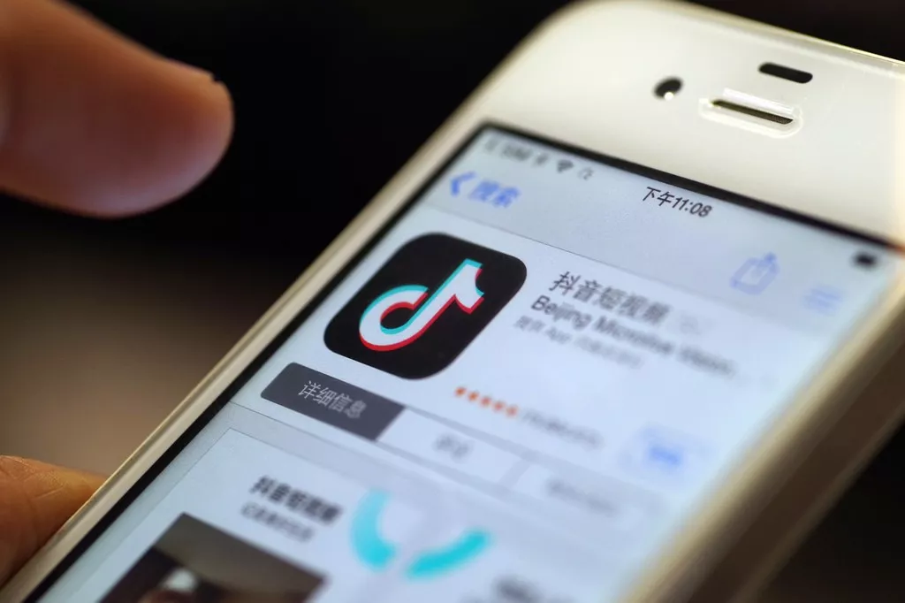

## 写给“我没有足够时间”的人

大多数人都高估了他们一天所做的事情，但低估了他们一年可以做些什么。（[Stephen Smith](https://blog.stephsmith.io/you-dont-need-to-quit-your-job-to-make/)）

## 工作与挣钱

和人打交道的工作，就是越老越值钱的，和机器/计算机打交道的工作，就是越老越不值钱的。（tailor [豆瓣评论](https://www.douban.com/group/topic/134870474/)）

---
完。感谢阅读。