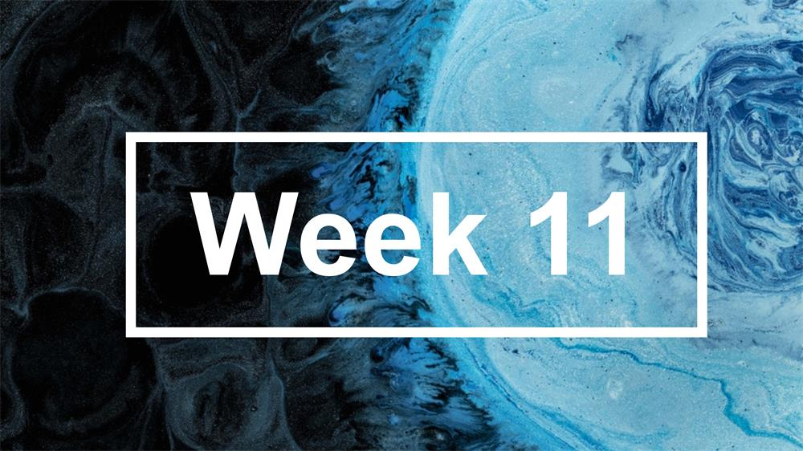

# 第11周

# 科普
* [斯德哥尔摩综合征](https://zh.wikipedia.org/wiki/%E6%96%AF%E5%BE%B7%E5%93%A5%E7%88%BE%E6%91%A9%E7%97%87%E5%80%99%E7%BE%A4)

斯德哥尔摩综合征，又称为人质情结、抖M，是一种心理学现象。指犯罪的被害者对于加害者产生情感、同情加害者，认同加害者的某些观点和想法，甚至反过来帮助加害者的一种情结。

* [巴纳姆效应](https://zh.wikipedia.org/wiki/%E5%B7%B4%E7%B4%8D%E5%A7%86%E6%95%88%E6%87%89)

巴纳姆效应是一种心理现象，人们会对于为自己量身订做的一些人格描述，给予高度准确的评价。这些描述往往十分模糊和普遍，适合于任何人。巴纳姆效应从一定程度上解释了为什么人们愿意相信伪科学，如占星学、占卜或心理测验等。

* [史上最富有之人](https://www.bbc.com/news/world-africa-47379458)

根据2019年福布斯亿万富豪名单，亚马逊创始人杰夫贝佐斯是世界上最富有的人。 他的财富估计为1310亿美元（990亿英镑），是现代历史上最富有的人。但他并不是历史以来最富有的人。这个头衔属于14世纪西非统治者曼萨穆萨（Mansa Musa），他的慷慨捐赠几乎破坏了整个国家的经济。

* [学会忘记：遗忘比记忆需要更多脑力](http://www.ebiotrade.com/newsf/2019-3/2019312111408328.htm)

德州大学奥斯汀分校的研究人员通过神经成像发现，选择忘记某件事可能比试图记住它需要更多脑力劳动。

* [金星不是离地球最近的行星](https://physicstoday.scitation.org/do/10.1063/PT.6.3.20190312a/full/)

平均而言，金星未必最接近地球，实际上过去 50 年的位置显示，水星在 46% 的时间里是最接近地球的行星，金星是 36%，火星是 18%。

* [你以为数据在云上，其实它在海里](https://www.nytimes.com/interactive/2019/03/10/technology/internet-cables-oceans.html)

近750,000英里的海底电缆连接着各大洲，以支持我们对通信和娱乐的需求。你以为网络数据存储在云上，其实它通过海底电缆传输。

* [实心图标PK线性图标](https://uxmovement.com/mobile/solid-vs-outline-icons-which-are-faster-to-recognize/)（[中文译文](https://www.sohu.com/a/301447687_470009)）

研究发现，图标样式会影响工作速度。通常情况下，实心图标比线性图标更快识别，但并非绝对。有的线性图标更容易识别，有的图标不论实心样式还是线性样式，用户的反应时间并没有太大的差异。

* [北京东四头条、东四四条、东四十条，这条是怎么回事儿？](https://zhuanlan.zhihu.com/p/39623877)

从北京城的发展看，为了便于记忆、避免重名，采取街道命名“序列化”的方式，将同一区域内依此排列的胡同、街巷以数字顺序命名，称“某某X条”。东四地区条数最多，一共有十四条。对于刚到北京的人来说，有点蒙圈，不知道的还以为是“东-四十条”，但实际上是**“东四-十条”**。

* [Emoji表情的发展历史](https://medium.com/@heytory/emojis-the-complete-history-6dc81a330144)

# 工具
* [Unicode日历生成器](https://beautifuldingbats.com/calendar-generator/)

以Unicode文本编码生成日历，非常有趣。注意最好用等宽字体，不然版式会乱掉。

* [VSCode网易云音乐插件](https://zhuanlan.zhihu.com/p/59013685)

VSCode插件，调用网易云接口搜索歌曲，适合追求简洁的码农用。

* [后续网：有记忆的新闻](https://houxu.app/)

新闻网站，持续追踪热点事件。即使热点周期已过，还会提供后续报道。

* [NewsLifeSpan：公众更愿意关注哪些事情](https://www.newslifespan.com/)

国外网站，以可视化形式提供新闻热点事件说明。

# 资源
* [知乎live笔记：前端工程师的入门与进阶](https://shenbao.github.io/2017/04/22/justjavac-live/)

解答了前端工程师进入行业的一些基本问题和疑惑，可以一读。

* [计算机科学自学指南](https://teachyourselfcs.com/)（[中文译文](http://blog.jobbole.com/114573/)）

通过互联网，学习世界顶级的CS（计算机科学）课程，文章提供了一些参考书目和学习方法。

* [在线阅读处理流程：从需求、到方法、再到工具](https://mp.weixin.qq.com/s/G2RfJsDdy5s3V1V-DqmmHA)

方法论和工具推荐，如何处理自己每天获取的信息。

# 国际
* [委内瑞拉大停电：“末日”一般的悲惨世界](https://www.bbc.com/zhongwen/simp/world-47554913)

委内瑞拉持续的停电停水让全国许多地区陷入瘫痪。40度高温，停电停水好几天，混乱的国家和贫困的人民，在黑暗中、饥饿中、死亡的边缘挣扎。有委内瑞拉人形容，这样过生活如同“世界末日一般”。

* [2019世界经济不容乐观](https://www.project-syndicate.org/commentary/global-economic-prospects-bleak-in-2019-by-kaushik-basu-2019-01)

发达经济体发展前景黯淡，即使一些新兴经济体能够实现强劲增长，世界经济仍将受到经济相互联系和政治巴尔干化的共同阻碍。 

# 中国
* [一二三线城市的消费习惯已经细碎的没有规律](https://mp.weixin.qq.com/s/xLF1I5hSar6jm_QCslodPg)

当下中国消费市场的变迁：一二线城市趋向理性消费，三四五线城市则开始享受消费升级，其中，三四线城市海淘越来越疯狂，不少往昔只能在一二线城市看到的进口品牌，在下沉市场获得了很好的销量。

* [32个省会地名，谁最文艺？](https://zhuanlan.zhihu.com/p/56242581)

分析了32个省会地名的别称，值得一读。

* [考研失败的年轻人，后来都怎样了](https://mp.weixin.qq.com/s/yyWOBpOakDlg7MDuz2-PIw)

从某种程度上来说，考研像是一个真空玻璃罩，隔绝掉了外界的种种压力与声音。而考研失败，则是玻璃罩的突然抽离，将罩内的人们暴露在真实之中。

# 互联网
* [万维网诞生三十周年，细数回忆中的A到Z](https://www.theverge.com/2019/3/12/18259700/world-wide-wide-turns-30-www-anniversary-favorite-sites)

文章按字母表顺序A到Z，回顾了三十年来一些与计算机相关的软件、语言或服务。令人惊讶的是，没有提到Google。

* [三十周岁的不是互联网，而是万维网](https://www.vox.com/2019/3/12/18260709/30th-anniversary-world-wide-web-google-doodle-history)

互联网和网络不是一回事。 互联网是一个巨大的计算机网络，人们通过网络进行通信和交换信息。 万维网则是一种常用的互联网访问方式。 如果互联网是一条信息高速公路，万维网则能让你沿着高速公路旅行。

* [移动互联网自律白名单](https://white.anva.org.cn/white/index)

为保证APP的各类安全性问题，而建立该名单，已加入名单的公司有腾讯、360、高德、优视、网泰、金山和百度等。

* [阮一峰：每周分享第 47 期](http://www.ruanyifeng.com/blog/2019/03/weekly-issue-47.html)

>  * 吃播盛行，本质与互相服务无异
>  * [写字机器人](https://www.thepaper.cn/newsDetail_forward_2998361)
>  * [Chrome 浏览器支持跳转到指定文字](https://www.chromestory.com/2019/02/chrome-scroll-to-text/)
>  * [wechat-format](https://github.com/lyricat/wechat-format)
>  * [声音地图](https://s3-us-west-1.amazonaws.com/vocs/map.html#)
>  * [Skype for Web](https://blogs.skype.com/news/2019/03/07/the-new-skype-for-web-is-here/)
>  * [GitNews](https://git.news/)
>  * [健身并不会带来健康](https://www.theguardian.com/news/2019/jan/03/why-exercise-alone-wont-save-us)

   

# 趣闻
* [Notion团队绝处逢生的故事](https://www.figma.com/blog/design-on-a-deadline-how-notion-pulled-itself-back-from-the-brink-of-failure/?utm_source=wanqu.co&utm_campaign=Wanqu+Daily&utm_medium=website)
* [VS2019背景图上的绿帽子引争端](https://developercommunity.visualstudio.com/content/problem/475341/vs-insta**er-we*come-image-contains-offensive-elem.html)
* [排名前一千万的网站有三分之一使用 WordPress](https://wordpress.org/news/2019/03/one-third-of-the-web/)
* [抖音海外版TikTok是如何改写世界的](https://cn.nytimes.com/technology/20190312/what-is-tik-tok/)
