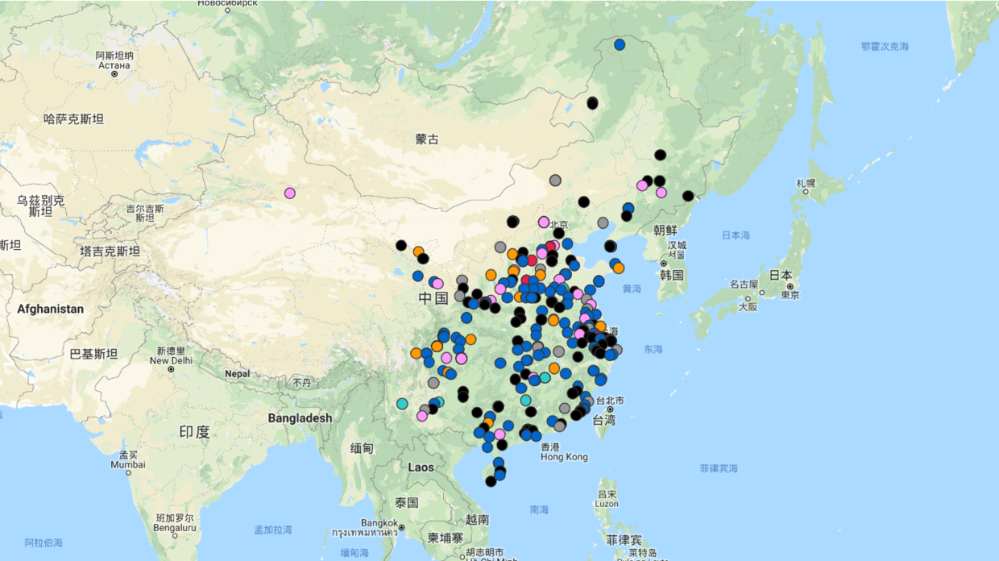

# 第12周

# 科普📔

* [椰子水能成为血浆替代品吗?](http://tech.sina.com.cn/d/v/2014-12-10/doc-iavxeafr6579286.shtml) （[英文](http://www.abc.net.au/science/articles/2014/12/09/4143229.htm)）

椰子水的钠含量约为血浆的四十分之一，而钾含量比血浆高10到15倍，还含有较高的钙和镁，酸性也远远超过血浆。所有这些都说明，椰子水与血浆绝不一样。不过，在极端紧急的情况下，椰子水还是可以尝试一用的。所以这个说法看起来荒诞不羁，但也有一定的真实成分。

* [止痛药也应分男女](https://www.wired.com/story/womens-pain-is-different-from-mens-the-drugs-could-be-too/)

男人和女人的痛感产生于不同的生物学途径，也就是说适用于一种性别的止痛药可能对另一性别无效。

* [统计学白学了?](https://mp.weixin.qq.com/s/7YtFivNSQNGSus6x2jHaSQ) （[英文](https://www.nature.com/articles/d41586-019-00857-9)）

Nature杂志发表了三位统计学家的一封公开信，他们号召科学家放弃追求“统计学意义”，并且停止用统计学中常见的P值作为判断标准。统计学上无显著的结果并不能“证明”零假设；统计上显著的结果也没有“证明”某些其他假设。事实究竟是这样吗？

* [神韵艺术团](https://zh.wikipedia.org/wiki/%E7%A5%9E%E9%9F%B5%E8%89%BA%E6%9C%AF%E5%9B%A2)

神韵艺术团成立于2006年，总部设于美国纽约州。神韵艺术团称其“艺术灵感取自儒、释、道学说发展，是中国传统文化的真正精髓”。神韵艺术团是由法#轮#功学员成立并经营管理，其在西方国家各剧院的演出频繁遭到中#共的阻挠破坏。

* [失望群岛](https://zh.wikipedia.org/zh-cn/%E5%A4%B1%E6%9C%9B%E7%BE%A4%E5%B3%B6)

该群岛拥有较为奇特的名称，因为它包含了“失望”这个词。有说法指出该群岛的名称是由英国皇家海军军官约翰·拜伦（John Byron）于1765年定下的。当时，他航至本群岛，并计划登陆。可是，他遭到了当地土著的敌视，并被攻击。他感到非常失望，故将本群岛取名为“失望群岛”。

参考阅读：[失望群岛之旅](http://www.bbc.com/travel/story/20190319-a-journey-to-the-disappointment-islands)

# 中国💖

* [三分之一的中国城市正在萎缩](https://www.scmp.com/economy/china-economy/article/3002219/almost-one-third-chinese-cities-are-shrinking-city-planners)

2013年至2016年，清华大学的一个研究小组利用卫星图像监测了3,300多个城镇的夜间照明强度，其中28％的城市灯光变暗。这表明中国近三分之一的城市人口正在萎缩。

* [崩溃的婚姻 ](https://www.sohu.com/a/302634595_313170)

数据显示，2018年全国结婚率（结婚人数 /同期总人口数）为7.2‰，创2013年来的新低，而离婚率则连续15年上升。其中经济越发达的地区，如上海、浙江、广东、北京，其结婚率越低。

绝多数人并不知道这意味着什么，他们只是在与日俱增的不安全感里，惶惑到底在发生些什么？而社会学家的概括则简单直白得多：“中国婚姻或许在火速终结，中国家庭或许在快速崩溃。”

* [中国只有10%的人出过国，4%的人念过本科，但他们也不是傻屌](https://mp.weixin.qq.com/s/uforkw2-idCYAiUSRK-1Ww)

“我们为什么要交这么多的税去养群人，那些穷人自己懒，所以穷，却要我们负担。凭什么？你弱你有理咯”我当时的回答是：总有那么一二三四个逗货否认阶级壁垒的存在，认为穷人之所以穷是因为不够努力。

这样的人要么傻要么坏。你们从小富裕的人往往觉得自己现在有的一切都是自己努力得来的。而只有出生贫寒的人才知道一个好的家庭究竟有多么重要。

* [凌云的酒店偷拍调查](https://mp.weixin.qq.com/s/6M6UUN6fjjD3Oy5IBIspNA)

# 国际🌏

* [在美国：穷人的孩子在减负，富人的孩子在苦读](https://mp.weixin.qq.com/s/ZrKOvR_1lAnnA2Dpr14u5A)

在任何国家，越有钱的家庭越努力，这是不争的事实。BBC拍了一个纪录片《交换学校：阶级划分》，将公立学校的孩子和私立学校的孩子进行交换体验。私立学校在招生的时候，不是有钱就欢迎，父母不仅要出得起昂贵的学费，绝大多数孩子的成绩还必须是A。

他们学习非常刻苦，每天6点半起床，5点放学，放学后还有填得满满的习题和课外活动。而公立学校的孩子们，8点起床，3点放学，放学后睡觉，可以一直打电脑游戏到吃晚餐。

* [日本专家小组认为基因编辑食品安全](https://www.sciencemag.org/news/2019/03/gene-edited-foods-are-safe-japanese-panel-concludes)

日本咨询委员会向厚生劳动省提出了一项有关转基因食品的提案，若该提案被采纳，则在相关技术合标的情况下，转基因食品有可能无需进行安全评估，直接销售给消费者。

* [世界上移民人数最多和比例最高国家](https://www.bbc.com/zhongwen/simp/world-47667454)

根据联合国2017年的数字，全世界大约有2亿5千8百万国际移民，大约占全球人口的3.4%。根据2015年的数字，从国家的移民人数来看美国是世界移民人数最多的国家，移民人数接近5000万人。美国移民人口占总人口的15%左右。

但如果从移民人口所占国家总人口比例上来看，那么阿联酋则位居榜首，该国的移民人口占总人口的88%。

# 科技💻

* [可支配时间的争夺](http://cn.nikkei.com/columnviewpoint/column/34562-2019-03-12-05-00-40.html)

科技的进步让人类的可支配时间增加了。在世界范围内，争夺“可支配时间”的趋势在扩大，这些时间能增加创造新价值，越来越受科技公司关注。

* [几个简单的方式提高你的上网隐私性](https://thetoolsweneed.com/a-few-simple-steps-to-vastly-increase-your-privacy-online/)

作者给出了一些提高上网安全性和隐私性的方法，包括使用火狐浏览器，使用各类擦除隐私信息的插件等，最重要的还是要有保护个人信息和隐私的意识。

# 工具🔑

* [Reeoo](https://reeoo.com/sim-sim-falafel)

呈现了各种网页设计，为设计师提供灵感。

* [中国安全事故地图](https://maps.clb.org.hk/accidents/zh-cn)

# 方法论📕

* [你有什么值得分享的高效学习方法？](https://www.douban.com/note/708967693/)

  * 一、走出时间管理的误区
  * 二、读懂大脑的真正需求
  * 三、重复建立“我可以”的态度
  * 四、建立一些优秀的习惯
  * 五、脱离舒适区
  * 六、学会优先管理的方法
  * 七、走出“压力越大，表现越好”的误区
  * 八、一些浅薄的学习方法和工具分享

* [为什么独立思考这么难？](https://program-think.blogspot.com/2019/03/Why-Thinking-Hard-So-Hard.html?m=1)（墙裂推荐👍）

* [不要人人都上大学，世界会不会更好?](https://www.theatlantic.com/magazine/archive/2018/01/whats-college-good-for/546590/)

* [人人都能当产品经理，是真的吗？](https://daily.zhihu.com/story/9708804)

产品经理的时代正在慢慢结束，这句话对么？说对也对，说不对也不对。说对是因为曾经人人都是产品经理的时代已经过去，产品经理职业化的时代已经慢慢开始。说不对是因为再好的产品也离不开后期的运营推广…酒香还怕巷子深。

* [HP大中华区总裁孙振耀退休感言](https://www.douban.com/group/topic/2718459/)

网传孙振耀退休感言，[当事人表示](http://it.sohu.com/20090320/n262919003.shtml)：“这篇退休感言大概有10%的内容是我写的。当然，我觉得更重要的是写这篇文章的人对大家的影响、启发，内容比谁来写更有意义。”内容非常值得一看。

* [如何高效学 Python？](https://sspai.com/post/53500)

有这么多现成的资源和路径，为什么许多人依然在为学 Python 犯愁呢？因为学习有个效率问题。Python 语法清晰明快，简单易学，这是 Python 如此普及的重要原因。但是，选择合适的 Python 学习方式，需要跟你自身的特性相结合。人

* [阮一峰：每周分享第 48 期](http://www.ruanyifeng.com/blog/2019/03/weekly-issue-48.html)

  * 人生的可能性很多，没必要一种职业干到老
  * [转基因蚊子](https://www.npr.org/sections/goatsandsoda/2019/02/20/693735499/scientists-release-controversial-genetically-modified-mosquitoes-in-high-securit)
  * [Search Icons Visually](http://compute.vision/nouns/index.html)
  * [Tracker 服务器列表](https://newtrackon.com/list)
  * [微出行的意义](https://florentcrivello.com/index.php/2019/01/28/five-promises-of-micromobility/)
  * 云计算领域对于学习者几乎没有进入障碍，只需要一点天生的好奇心。

---
完，感谢阅读。